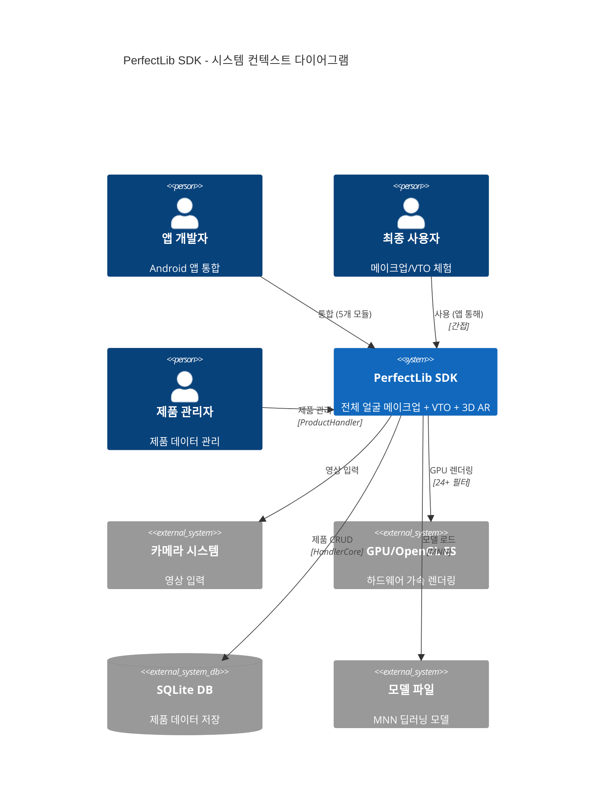
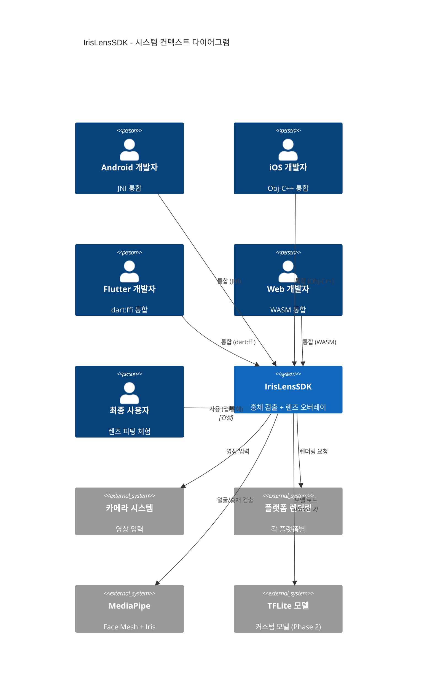
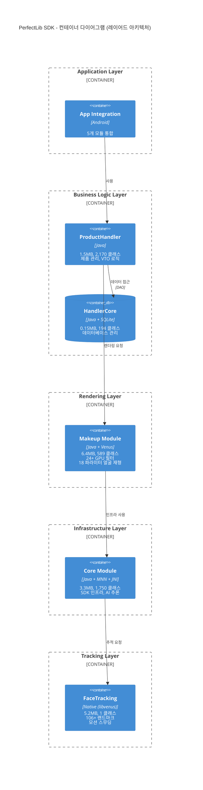
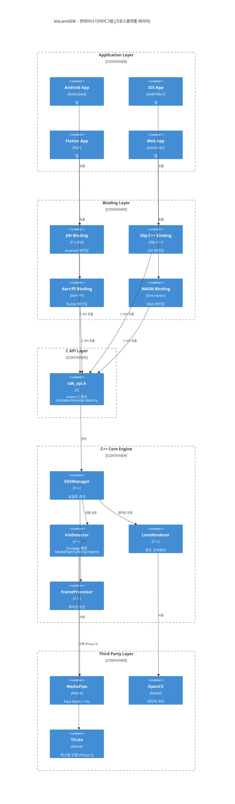
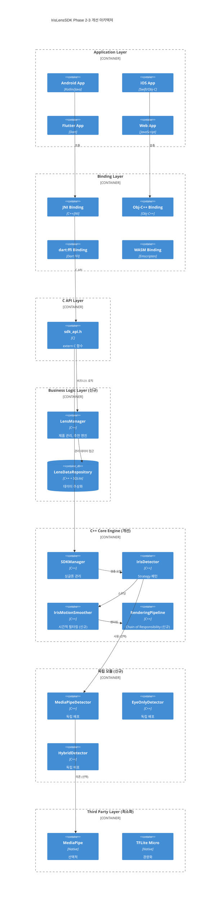

# PerfectLib vs IrisLensSDK 아키텍처 비교 분석

**작성일**: 2026-01-21
**분석 기준**: C4 모델 (Context, Container, Component, Code)
**목적**: 경쟁사 아키텍처 분석을 통한 IrisLensSDK 개선 방향 도출

---

## 📋 Executive Summary

### 핵심 발견사항

| 측면 | PerfectLib | IrisLensSDK | 권고사항 |
|------|-----------|-------------|---------|
| **아키텍처 철학** | 완전한 기능 제공 (Complete) | 핵심 기능 + 확장성 (Core + Extensibility) | 비즈니스 레이어 추가 필요 |
| **모듈화 전략** | 기능별 독립 모듈 (5개 jar) | 레이어별 분리 (3개 레이어) | 배포 단위 모듈화 고려 |
| **확장성 방향** | 수평 확장 (기능 추가) | 수직 확장 (알고리즘 교체) | 렌더링 파이프라인 확장 |
| **플랫폼 지원** | Android 전용 | 크로스플랫폼 (4개) | 현재 전략 유지 |
| **독자 기술** | 높음 (Venus, libvenus) | 낮음 (오픈소스 의존) | Phase 3 독자 모델 개발 |
| **비즈니스 통합** | 강함 (ProductHandler) | 없음 | LensManager 레이어 추가 |
| **SDK 크기** | 16.55MB | 목표 20MB | 경량 모델로 10MB 목표 |

### 종합 평가

**PerfectLib 강점**:
- ✅ 성숙한 비즈니스 로직 레이어
- ✅ 독자 렌더링 기술 (Venus)
- ✅ 모듈별 독립 배포 가능
- ✅ 시간적 일관성 (모션 스무딩)

**IrisLensSDK 강점**:
- ✅ 크로스플랫폼 설계 (C API)
- ✅ 알고리즘 교체 용이 (Strategy)
- ✅ 명확한 추상화 레이어
- ✅ 테스트 가능한 구조

---

## 1️⃣ 시스템 컨텍스트 레벨 비교 (C4 Level 1)

### 1.1 PerfectLib 시스템 컨텍스트



**특징**:
- 제품 관리자가 별도 사용자로 존재 (비즈니스 통합)
- SQLite 데이터베이스와 강결합
- 24+ GPU 필터로 복잡한 렌더링
- 전체 얼굴 메이크업 + 8종류 VTO

### 1.2 IrisLensSDK 시스템 컨텍스트



**특징**:
- 4개 플랫폼 개발자가 별도 사용자 (크로스플랫폼 우선)
- 제품 관리 시스템 부재 (기술 기능만 제공)
- MediaPipe 외부 의존
- 홍채에만 집중 (좁고 깊게)

### 1.3 시스템 컨텍스트 차이점

| 측면 | PerfectLib | IrisLensSDK | 분석 |
|------|-----------|-------------|------|
| **사용자 범위** | 개발자 + 제품 관리자 | 4개 플랫폼 개발자 | PerfectLib은 비즈니스 사용자 고려 |
| **외부 시스템** | DB + GPU + 모델 | 플랫폼 렌더링 + 모델 | PerfectLib은 데이터 중심, IrisLensSDK는 플랫폼 중심 |
| **기능 범위** | 전체 얼굴 + VTO + 3D AR | 홍채 검출 + 오버레이 | PerfectLib은 완전한 솔루션, IrisLensSDK는 핵심 기능 |
| **통합 복잡도** | 5개 모듈 통합 | C API 단일 인터페이스 | IrisLensSDK가 통합 용이 |

---

## 2️⃣ 컨테이너 레벨 비교 (C4 Level 2)

### 2.1 PerfectLib 컨테이너 구조



**레이어 구조**:
```
Application (앱 통합)
    ↓
Business Logic (ProductHandler: 제품 관리 + VTO)
    ↓
Data Layer (HandlerCore: SQLite)
    ↓
Rendering (Makeup: Venus 엔진 + 24+ 필터)
    ↓
Infrastructure (Core: MNN + JNI)
    ↓
Tracking (FaceTracking: libvenus + 모션 스무딩)
```

**모듈 특징**:

| 모듈 | 크기 | 클래스 | 네이티브 | 역할 | 독립성 |
|------|------|--------|---------|------|--------|
| ProductHandler | 1.5MB | 2,170 | 없음 | 비즈니스 로직 | 중간 |
| HandlerCore | 0.15MB | 194 | 없음 | 데이터 레이어 | 높음 |
| Makeup | 6.4MB | 589 | libvenus | 렌더링 엔진 | 중간 |
| Core | 3.3MB | 1,750 | MNN, libperfect | SDK 인프라 | 낮음 |
| FaceTracking | 5.2MB | 1 | libvenus_tracking | 얼굴 추적 | 높음 |

### 2.2 IrisLensSDK 컨테이너 구조



**레이어 구조**:
```
Application Layer (Android/iOS/Flutter/Web)
    ↓
Binding Layer (JNI/Obj-C++/dart:ffi/WASM)
    ↓
C API Layer (extern "C" 함수들)
    ↓
C++ Core Engine (SDKManager → Detector/Renderer/Processor)
    ↓
Third Party (MediaPipe/OpenCV/TFLite)
```

**레이어 특징**:

| 레이어 | 역할 | 기술 | 독립성 |
|--------|------|------|--------|
| Application | 앱 통합 | 각 플랫폼 네이티브 | 높음 |
| Binding | 플랫폼 적응 | JNI/Obj-C++/FFI/WASM | 높음 |
| C API | 통합 인터페이스 | extern "C" | 높음 |
| C++ Core | 핵심 로직 | C++17 | 중간 |
| Third Party | 외부 의존 | MediaPipe/OpenCV | 낮음 |

### 2.3 컨테이너 레벨 차이점

| 측면 | PerfectLib | IrisLensSDK | 분석 |
|------|-----------|-------------|------|
| **모듈화 기준** | 기능별 (제품/렌더링/추적) | 플랫폼별 (바인딩 레이어) | PerfectLib은 배포 단위, IrisLensSDK는 코드 조직 |
| **레이어 수** | 5개 (Application → Tracking) | 5개 (Application → Third Party) | 유사하지만 책임 분리 방식 다름 |
| **의존 방향** | 하향 (상위 → 하위만) | 하향 (상위 → 하위만) | 둘 다 계층화 아키텍처 |
| **독립 배포** | 가능 (각 모듈 jar) | 불가 (단일 코어 엔진) | PerfectLib이 유리 |
| **비즈니스 로직** | 있음 (ProductHandler) | 없음 | IrisLensSDK 개선 필요 |
| **데이터 관리** | 있음 (HandlerCore) | 없음 | IrisLensSDK 개선 필요 |
| **크로스플랫폼** | 없음 (Android 전용) | 있음 (C API) | IrisLensSDK 강점 |

---

## 3️⃣ 아키텍처 패턴 분석

### 3.1 PerfectLib 아키텍처 패턴

#### 패턴 1: Layered Architecture (계층화 아키텍처)

```
┌──────────────────────────────────┐
│   Application Integration        │  앱 통합
├──────────────────────────────────┤
│   Business Logic Layer           │  ProductHandler
│   (VTO, 제품 관리)                 │
├──────────────────────────────────┤
│   Data Layer                     │  HandlerCore (SQLite)
├──────────────────────────────────┤
│   Rendering Layer                │  Makeup (Venus + GPU)
├──────────────────────────────────┤
│   Infrastructure Layer           │  Core (MNN + JNI)
├──────────────────────────────────┤
│   Tracking Layer                 │  FaceTracking (libvenus)
└──────────────────────────────────┘
```

**효과**:
- ✅ 명확한 책임 분리
- ✅ 각 레이어 독립 개발 가능
- ✅ 이해하기 쉬운 구조
- ❌ 레이어 간 통신 오버헤드

#### 패턴 2: Facade Pattern (Core 모듈)

```
┌─────────────────────────────────────┐
│          Core Module                │
│  ┌─────────────────────────────┐   │
│  │   Unified Interface         │   │
│  └─────────────────────────────┘   │
│        ↓           ↓           ↓    │
│      MNN      libperfect      JNI  │
└─────────────────────────────────────┘
```

**효과**:
- ✅ 복잡한 하위 시스템을 단일 인터페이스로 추상화
- ✅ 상위 모듈의 하위 의존 감소
- ✅ SDK 사용성 향상

#### 패턴 3: Data Access Object (HandlerCore)

```
ProductHandler
    ↓
HandlerCore (DAO)
    ↓
SQLite Database
```

**효과**:
- ✅ 데이터 소스 변경 용이 (SQLite → API)
- ✅ 비즈니스 로직과 데이터 레이어 분리
- ✅ 테스트 가능 (Mock DAO)

#### 패턴 4: Pipeline Architecture (Makeup)

```
입력 이미지
    ↓
GPU 필터 1 (색상 보정)
    ↓
GPU 필터 2 (블러)
    ↓
GPU 필터 3 (립스틱)
    ↓
...
    ↓
GPU 필터 24+ (최종 합성)
    ↓
출력 이미지
```

**효과**:
- ✅ 렌더링 순서 제어
- ✅ 필터 조합 가능
- ✅ 새 필터 추가 용이

#### 패턴 5: Motion Smoothing (FaceTracking)

```
FaceAlignMotionSmoother:
- Temporal Filtering (시간적 필터링)
- Kalman Filter 또는 Moving Average
- 프레임 간 일관성 유지
```

**효과**:
- ✅ 떨림 감소
- ✅ 사용자 경험 향상
- ✅ 시간적 일관성

### 3.2 IrisLensSDK 아키텍처 패턴

#### 패턴 1: Strategy Pattern (IrisDetector)

```
IrisDetector (인터페이스)
├── MediaPipeDetector (Phase 1: MediaPipe 기반)
├── EyeOnlyDetector (Phase 2: 커스텀 모델)
└── HybridDetector (Phase 2: MediaPipe 실패 시 EyeOnly 폴백)

런타임 교체:
SDKManager.setDetector(new EyeOnlyDetector())
```

**효과**:
- ✅ 알고리즘 런타임 교체 가능
- ✅ A/B 테스팅 용이
- ✅ 각 검출기 독립 개발
- ✅ 테스트 가능 (Mock Detector)

#### 패턴 2: Singleton Pattern (SDKManager)

```cpp
class SDKManager {
public:
    static SDKManager& getInstance() {
        static SDKManager instance;
        return instance;
    }
private:
    SDKManager() {}
    SDKManager(const SDKManager&) = delete;
    SDKManager& operator=(const SDKManager&) = delete;
};
```

**효과**:
- ✅ 전역 SDK 상태 관리
- ✅ 리소스 공유 (모델 파일)
- ⚠️ 멀티스레드 안전성 필요

#### 패턴 3: Adapter Pattern (Binding Layer)

```
C++ Core Engine (sdk_api.h)
    ↓ (C API)
┌───┴───┬───────┬──────────┬───────┐
│ JNI   │ Obj-C++│ dart:ffi │ WASM  │
│ Java  │  Swift │   Dart   │  JS   │
└───────┴────────┴──────────┴───────┘
```

**효과**:
- ✅ 단일 코어를 다양한 플랫폼에 적응
- ✅ 코어 코드 재사용
- ✅ 플랫폼별 최적화 가능

#### 패턴 4: Template Method (FrameProcessor 예상)

```cpp
class FrameProcessor {
public:
    void process(Frame& frame) {
        preprocess(frame);      // 전처리
        detect(frame);          // 검출
        render(frame);          // 렌더링
        postprocess(frame);     // 후처리
    }
protected:
    virtual void preprocess(Frame&) = 0;
    virtual void postprocess(Frame&) = 0;
};
```

**효과**:
- ✅ 처리 파이프라인 표준화
- ✅ 단계별 확장 가능
- ✅ 알고리즘 재사용

#### 패턴 5: Dependency Injection (Third Party)

```cpp
class MediaPipeDetector : public IrisDetector {
public:
    MediaPipeDetector(MediaPipeWrapper* mediapipe)
        : mediapipe_(mediapipe) {}

private:
    MediaPipeWrapper* mediapipe_;
};
```

**효과**:
- ✅ 외부 라이브러리 교체 가능
- ✅ 테스트 용이 (Mock 주입)
- ✅ 의존성 명시적

### 3.3 아키텍처 패턴 비교

| 패턴 | PerfectLib | IrisLensSDK | 효과 비교 |
|------|-----------|-------------|----------|
| **확장 방식** | Layered (수평 확장) | Strategy (수직 교체) | PerfectLib: 기능 추가, IrisLensSDK: 알고리즘 교체 |
| **모듈화** | 기능별 독립 모듈 | 레이어별 분리 | PerfectLib: 배포 단위, IrisLensSDK: 코드 조직 |
| **재사용** | Facade로 통합 | Adapter로 다중화 | PerfectLib: 내부 재사용, IrisLensSDK: 외부 재사용 |
| **복잡도 관리** | 모듈 간 의존 | 플랫폼 바인딩 | PerfectLib: 버전 호환성, IrisLensSDK: ABI 호환성 |
| **렌더링** | Pipeline (24+ 필터) | 단순 오버레이 | PerfectLib: 고급 렌더링, IrisLensSDK: 기본 렌더링 |
| **데이터** | DAO 패턴 (SQLite) | 없음 | PerfectLib: 데이터 중심, IrisLensSDK: 기술 중심 |

---

## 4️⃣ 확장성 평가

### 4.1 시나리오별 확장성 분석

#### 시나리오 1: 새로운 검출 알고리즘 추가

**PerfectLib**:
```
수정 범위: Core 모듈 전체 수정
영향도: Core에 의존하는 모든 상위 모듈 재컴파일
복잡도: 높음 (MNN, libperfect와 통합 필요)
테스트: 전체 SDK 회귀 테스트

예시:
- 새 얼굴 추적 모델 추가
- Core의 모델 로더 수정
- Makeup, ProductHandler 재컴파일
- 전체 통합 테스트 필요
```

**IrisLensSDK**:
```
수정 범위: 새 Detector 클래스만 추가
영향도: 없음 (Strategy 패턴으로 격리)
복잡도: 낮음 (IrisDetector 인터페이스만 구현)
테스트: 새 Detector만 단위 테스트

예시:
class NewDetector : public IrisDetector {
    DetectionResult detect(const Frame& frame) override {
        // 새 알고리즘 구현
    }
};
```

**결론**: ✅ **IrisLensSDK 압도적 우위** (Strategy 패턴 효과)

---

#### 시나리오 2: 새로운 렌더링 기능 추가 (블러 효과)

**PerfectLib**:
```
수정 범위: Makeup 모듈 (Venus 엔진)
영향도: 낮음
복잡도: 중간 (GPU 필터 체인에 추가)
확장 메커니즘: 기존 24+ 필터에 추가하는 방식으로 설계됨

예시:
class BlurFilter : public GPUFilter {
    void apply(Texture& texture) {
        // GPU 셰이더로 블러 구현
    }
};
makeup.addFilter(new BlurFilter());
```

**IrisLensSDK**:
```
수정 범위: LensRenderer 수정
영향도: 중간 (렌더링 파이프라인 전체 영향)
복잡도: 높음 (플랫폼별 렌더링 구현 필요)
확장 메커니즘: 명확하지 않음 (Phase 1 기준)

예시:
// LensRenderer 내부 수정 필요
void LensRenderer::render(...) {
    // 기존 렌더링 코드
    // + 블러 효과 추가 (어디에?)
}
```

**결론**: ✅ **PerfectLib 우위** (렌더링 특화 아키텍처)

---

#### 시나리오 3: 새로운 플랫폼 추가 (Unity)

**PerfectLib**:
```
수정 범위: Core 모듈 (JNI 외 C# 바인딩 추가)
영향도: 높음 (Core 모듈 재구성)
복잡도: 높음 (5개 모듈 통합 방식 재설계)
기존 설계: Android 전용 (jar 기반)

문제:
- jar 모듈을 Unity로 어떻게 통합?
- C# P/Invoke로 전체 재작성?
- 5개 모듈 독립성 유지 어려움
```

**IrisLensSDK**:
```
수정 범위: Binding Layer에 Unity 바인딩 추가
영향도: 없음 (C API는 변경 없음)
복잡도: 낮음 (C API → C# P/Invoke)
기존 설계: 크로스플랫폼 전제 (C API)

예시:
// Unity C# Binding
[DllImport("iris_sdk")]
private static extern IntPtr iris_sdk_init();

[DllImport("iris_sdk")]
private static extern void iris_sdk_detect(...);
```

**결론**: ✅ **IrisLensSDK 압도적 우위** (C API 레이어의 힘)

---

#### 시나리오 4: 제품 관리 시스템 통합

**PerfectLib**:
```
수정 범위: 없음 (이미 ProductHandler + HandlerCore 존재)
영향도: 없음
복잡도: 낮음 (기존 인터페이스 활용)

예시:
ProductHandler.addProduct(new Product(...));
ProductHandler.getProductById(id);
HandlerCore.query("SELECT * FROM products");
```

**IrisLensSDK**:
```
수정 범위: 새로운 모듈 추가 필요
영향도: 높음 (아키텍처 확장)
복잡도: 높음 (설계되지 않음)
확장 메커니즘: 없음

문제:
- 어디에 추가? (C++ Core? Binding Layer?)
- 데이터 저장은? (SQLite? JSON?)
- 플랫폼별 구현? (4번 반복?)
```

**결론**: ✅ **PerfectLib 압도적 우위** (비즈니스 레이어 존재)

---

#### 시나리오 5: 성능 최적화 (멀티스레드)

**PerfectLib**:
```
유리한 점: 모듈 독립성으로 각 모듈 별도 스레드 가능
불리한 점: 모듈 간 데이터 공유 복잡

병렬화:
Thread 1: FaceTracking (106+ 랜드마크 추적)
Thread 2: Makeup (Venus 렌더링)
Thread 3: ProductHandler (제품 데이터 로드)
→ 모듈 간 동기화 필요
```

**IrisLensSDK**:
```
유리한 점: 단일 코어로 파이프라인 최적화 용이
불리한 점: 검출/렌더링 강결합 시 병렬화 어려움

병렬화:
Thread 1: IrisDetector (MediaPipe)
Thread 2: LensRenderer (오버레이)
→ Strategy 패턴으로 독립 실행 가능
```

**결론**: ⚖️ **PerfectLib 약간 우위** (모듈 독립성)

---

### 4.2 확장성 종합 평가

| 확장 영역 | PerfectLib | IrisLensSDK | 승자 | 이유 |
|----------|-----------|-------------|------|------|
| **검출 알고리즘** | ⭐⭐ | ⭐⭐⭐⭐⭐ | IrisLensSDK | Strategy 패턴의 압도적 우위 |
| **렌더링 기능** | ⭐⭐⭐⭐ | ⭐⭐ | PerfectLib | Venus 필터 체인 아키텍처 |
| **플랫폼 확장** | ⭐⭐ | ⭐⭐⭐⭐⭐ | IrisLensSDK | C API 레이어의 힘 |
| **비즈니스 로직** | ⭐⭐⭐⭐⭐ | ⭐ | PerfectLib | ProductHandler 존재 |
| **성능 최적화** | ⭐⭐⭐⭐ | ⭐⭐⭐ | PerfectLib | 모듈 독립성 |
| **VTO 기능 추가** | ⭐⭐⭐⭐ | ⭐ | PerfectLib | 기능 범위 설계 |

**핵심 인사이트**:
- **IrisLensSDK**: 알고리즘 교체와 플랫폼 확장에 최적화 (수직 확장)
- **PerfectLib**: 기능 추가와 비즈니스 통합에 최적화 (수평 확장)
- **확장성 방향이 다름**: 두 SDK는 서로 다른 확장 전략을 가짐

---

## 5️⃣ IrisLensSDK 개선 권고사항

### 5.1 모듈화 전략 개선 ⭐⭐⭐⭐⭐

#### 현재 문제점
- 단일 코어 엔진 (모듈 독립 배포 불가)
- 사용자가 필요 없는 기능도 포함
- SDK 크기 최적화 어려움

#### PerfectLib에서 배운 점
- 기능별 독립 모듈 (5개 jar)
- 각 모듈 독립 배포 가능
- 사용자가 필요한 기능만 선택

#### 개선 제안

```
현재: 단일 코어 엔진
iris-sdk.so (전체 기능 포함)

개선: 레이어별 독립 모듈화
iris-core.so (코어 인프라)
├── iris-detector-mediapipe.so (MediaPipe 검출기)
├── iris-detector-eyeonly.so (커스텀 검출기)
├── iris-detector-hybrid.so (하이브리드 검출기)
├── iris-renderer-basic.so (기본 렌더링)
├── iris-renderer-advanced.so (고급 효과)
├── iris-data.so (데이터 관리)
└── iris-platform-[android|ios|flutter|web].so
```

**배포 예시**:
```gradle
// 사용자가 필요한 모듈만 선택
dependencies {
    implementation 'com.irislens:core:1.0.0'                    // 필수
    implementation 'com.irislens:detector-mediapipe:1.0.0'      // 선택 1
    // implementation 'com.irislens:detector-eyeonly:1.0.0'     // 선택 2
    implementation 'com.irislens:renderer-basic:1.0.0'          // 선택
}
```

**효과**:
- ✅ SDK 크기 최적화 (필요한 모듈만)
- ✅ 검출기별 독립 배포
- ✅ 모듈별 독립 개발/테스트
- ✅ 사용자 선택권 향상

**우선순위**: ⭐⭐⭐⭐⭐ (Phase 2 즉시 적용)

---

### 5.2 비즈니스 로직 레이어 추가 ⭐⭐⭐⭐

#### 현재 문제점
- 기술 기능만 제공 (검출 + 렌더링)
- 앱 개발자가 비즈니스 로직 직접 구현
- 렌즈 제품 관리 표준 없음

#### PerfectLib에서 배운 점
- ProductHandler: VTO 비즈니스 로직
- HandlerCore: 제품 데이터 관리
- SDK가 비즈니스 가치 제공

#### 개선 제안

```
신규 모듈: iris-lens-manager (Phase 2)

역할:
1. 렌즈 제품 관리 (색상, 패턴, 브랜드)
2. 렌즈 컬렉션 (사용자 맞춤)
3. VTO 세션 관리 (히스토리, 즐겨찾기)
4. 렌즈 추천 엔진 (얼굴 톤 분석 기반)

구조:
┌─────────────────────────────────────┐
│       LensManager                   │
│  (비즈니스 로직)                      │
├─────────────────────────────────────┤
│    LensDataRepository               │
│  (데이터 추상화 - DAO 패턴)           │
├─────────────────────────────────────┤
│  SQLite / JSON / Remote API         │
│  (데이터 소스 - 교체 가능)            │
└─────────────────────────────────────┘
```

**API 예시**:
```cpp
class LensManager {
public:
    // 렌즈 제품 관리
    std::vector<Lens> getLensByCategory(Category category);
    Lens getLensById(const std::string& id);

    // 사용자 맞춤
    void addToFavorites(const std::string& lensId);
    std::vector<Lens> getFavorites();

    // 추천 엔진
    std::vector<Lens> recommendByFaceTone(FaceTone tone);

    // 세션 관리
    void saveSession(const Session& session);
    std::vector<Session> getHistory();
};
```

**효과**:
- ✅ SDK가 비즈니스 가치 제공
- ✅ 앱 개발자 통합 부담 감소
- ✅ 렌즈 제품 관리 표준화
- ✅ 사용자 경험 향상

**우선순위**: ⭐⭐⭐⭐ (Phase 3 적용)

---

### 5.3 렌더링 파이프라인 확장성 개선 ⭐⭐⭐⭐⭐

#### 현재 문제점
- LensRenderer 단일 클래스 (확장 어려움)
- 새 효과 추가 시 전체 수정 필요
- 효과 조합 불가능

#### PerfectLib에서 배운 점
- Venus 엔진: 24+ GPU 필터
- 파이프라인 아키텍처로 필터 조합
- 각 필터 독립 개발 가능

#### 개선 제안

```
현재: LensRenderer (단일 클래스)
class LensRenderer {
    void render(Frame& frame, Lens& lens) {
        // 모든 렌더링 로직이 여기에
    }
};

개선: Rendering Pipeline (Chain of Responsibility)

┌──────────────────────────────────────────────────┐
│              RenderingPipeline                   │
├──────────────────────────────────────────────────┤
│  InputStage                                      │
│    ↓                                             │
│  PreprocessStage (전처리)                         │
│    ↓                                             │
│  LensOverlayStage (렌즈 오버레이)                  │
│    ↓                                             │
│  EffectStage (효과 필터) ← 신규                    │
│  ├── BlurEffect                                  │
│  ├── ColorAdjustEffect                           │
│  └── LightingEffect                              │
│    ↓                                             │
│  OutputStage (출력)                               │
└──────────────────────────────────────────────────┘
```

**구현 예시**:
```cpp
// Chain of Responsibility 패턴
class RenderStage {
public:
    virtual void process(Frame& frame) = 0;
    void setNext(RenderStage* next) { next_ = next; }
protected:
    void processNext(Frame& frame) {
        if (next_) next_->process(frame);
    }
private:
    RenderStage* next_ = nullptr;
};

class BlurEffect : public RenderStage {
public:
    void process(Frame& frame) override {
        applyBlur(frame);
        processNext(frame);
    }
};

// 사용
RenderingPipeline pipeline;
pipeline.addStage(new LensOverlayStage());
pipeline.addStage(new BlurEffect());
pipeline.addStage(new LightingEffect());
pipeline.render(frame);
```

**효과**:
- ✅ 새 효과 추가가 기존 코드에 영향 없음
- ✅ 효과 조합 가능 (블러 + 조명)
- ✅ 각 스테이지 독립 테스트/최적화
- ✅ 사용자가 효과 선택 가능

**우선순위**: ⭐⭐⭐⭐⭐ (Phase 2 즉시 적용)

---

### 5.4 모션 스무딩 추가 ⭐⭐⭐⭐⭐

#### 현재 문제점
- 프레임 간 홍채 위치 불일치
- 렌즈 떨림 발생
- 사용자 경험 저하

#### PerfectLib에서 배운 점
- FaceAlignMotionSmoother: 시간적 일관성
- 106+ 랜드마크 추적에서도 떨림 방지
- 떨림 감소가 UX의 핵심

#### 개선 제안

```
신규 컴포넌트: IrisMotionSmoother (Phase 2)

역할:
- 홍채 위치 시간적 필터링
- Kalman Filter 또는 Moving Average
- 프레임 간 일관성 유지

통합:
┌──────────────────────────────────────────┐
│  IrisDetector                            │
│    ↓ (raw iris position)                │
│  IrisMotionSmoother ← 신규                │
│    ↓ (smoothed iris position)           │
│  LensRenderer                            │
└──────────────────────────────────────────┘
```

**구현 예시**:
```cpp
class IrisMotionSmoother {
public:
    IrisPosition smooth(const IrisPosition& raw) {
        // Kalman Filter 적용
        kalmanFilter_.predict();
        return kalmanFilter_.update(raw);
    }

    void reset() {
        kalmanFilter_.reset();
    }

private:
    KalmanFilter kalmanFilter_;
    std::deque<IrisPosition> history_;  // 최근 N 프레임
};
```

**효과**:
- ✅ 렌즈 떨림 감소
- ✅ 사용자 경험 향상
- ✅ 30fps에서 안정적 렌더링
- ✅ 프레임 간 일관성 유지

**우선순위**: ⭐⭐⭐⭐⭐ (Phase 2 즉시 적용)

---

### 5.5 의존성 관리 개선 ⭐⭐⭐⭐

#### 현재 문제점
- MediaPipe: 무거움 (~10MB)
- OpenCV: 불필요한 기능 많음
- 외부 의존으로 SDK 크기 증가

#### PerfectLib에서 배운 점
- 독자 기술 (Venus, libvenus_tracking)
- MNN: 경량 딥러닝 프레임워크
- 외부 의존 최소화

#### 개선 제안

**Phase 2: 커스텀 경량 모델**
```
MediaPipe (~10MB) → EyeOnly 커스텀 모델 (2-3MB)
- 홍채 검출에만 특화
- TFLite Micro 사용
- 모델 양자화 (INT8)

OpenCV (전체) → 필요 함수만 직접 구현
- 이미지 리사이징
- 색상 공간 변환
- 기본 필터링
→ 자체 구현으로 의존성 제거

TFLite → 최소 기능만 포함
- Interpreter만 사용
- 불필요한 연산자 제거
```

**Phase 3: 독자 기술 검토**
```
자체 홍채 검출 모델 개발
- 홍채 특화 아키텍처
- 모바일 최적화 (MobileNet 기반)
- 라이선스 리스크 제거

최적화된 렌더링 엔진
- GPU 셰이더 직접 작성
- 플랫폼별 최적화
- 외부 의존 완전 제거
```

**효과**:
- ✅ SDK 크기 감소 (20MB → 10MB 목표)
- ✅ 성능 향상 (불필요한 기능 제거)
- ✅ 라이선스 리스크 감소
- ✅ 외부 의존 최소화

**우선순위**: ⭐⭐⭐⭐ (Phase 2-3 적용)

---

### 5.6 성능 최적화 아키텍처 ⭐⭐⭐

#### 현재 문제점
- 단일 스레드 처리 (검출 → 렌더링 순차)
- 프레임 드롭 가능성
- 30fps 유지 어려움

#### PerfectLib에서 배운 점
- 모듈별 독립 실행 (병렬 처리)
- GPU 가속 (OpenGL ES)
- 106+ 랜드마크 실시간 추적

#### 개선 제안

**Phase 2: 병렬 처리 파이프라인**
```
Producer-Consumer 패턴:

┌─────────────┐     ┌──────────────┐     ┌─────────────┐
│ Camera      │────▶│ Frame Queue  │────▶│ Detector    │
│ Thread      │     │ (Lock-Free)  │     │ Thread      │
└─────────────┘     └──────────────┘     └─────────────┘
                                                │
                                                ▼
                                          ┌─────────────┐
                                          │ Render      │
                                          │ Thread      │
                                          └─────────────┘

특징:
- Lock-Free Queue (boost::lockfree::queue)
- 검출과 렌더링 병렬 처리
- 프레임 드롭 감소
```

**구현 예시**:
```cpp
class ParallelPipeline {
public:
    void start() {
        detectorThread_ = std::thread([this]() {
            while (running_) {
                Frame frame;
                if (frameQueue_.pop(frame)) {
                    auto result = detector_->detect(frame);
                    resultQueue_.push(result);
                }
            }
        });

        renderThread_ = std::thread([this]() {
            while (running_) {
                DetectionResult result;
                if (resultQueue_.pop(result)) {
                    renderer_->render(result);
                }
            }
        });
    }

private:
    boost::lockfree::queue<Frame> frameQueue_;
    boost::lockfree::queue<DetectionResult> resultQueue_;
    std::thread detectorThread_;
    std::thread renderThread_;
};
```

**효과**:
- ✅ 검출과 렌더링 병렬 처리
- ✅ 프레임 드롭 감소
- ✅ 30fps → 60fps 목표
- ✅ CPU 코어 활용 극대화

**우선순위**: ⭐⭐⭐ (Phase 3 적용)

---

### 5.7 테스트 및 품질 보증 강화 ⭐⭐⭐⭐

#### 현재 문제점
- 테스트 커버리지 낮음
- 플랫폼별 회귀 테스트 부족
- 성능 벤치마크 자동화 없음

#### PerfectLib 추정
- 4,704 클래스 → 대규모 자동화 테스트
- 모듈별 독립 테스트

#### 개선 제안

**테스트 전략 강화**:

```
1. 단위 테스트 (Unit Tests)
   - 각 Detector별 정확도 테스트
   - 렌더링 파이프라인 스테이지별 테스트
   - Mock 객체로 독립 테스트

2. 통합 테스트 (Integration Tests)
   - 플랫폼별 E2E 테스트 (Playwright 활용)
   - 성능 벤치마크 (30fps 보장)
   - 메모리 누수 검출

3. 회귀 테스트 (Regression Tests)
   - Golden Image 비교 (렌더링 결과)
   - 성능 회귀 자동 검출
   - 프레임별 정확도 비교

4. 플랫폼 호환성 테스트 (Compatibility Tests)
   - 4개 플랫폼 매트릭스 테스트
   - CI/CD 자동화 (GitHub Actions)
   - 디바이스 팜 통합
```

**CI/CD 파이프라인**:
```yaml
# .github/workflows/test.yml
name: Test Suite

on: [push, pull_request]

jobs:
  unit-tests:
    runs-on: ubuntu-latest
    steps:
      - name: Run C++ Unit Tests
        run: |
          cd cpp/cmake-build-debug
          ctest --output-on-failure

  integration-tests:
    strategy:
      matrix:
        platform: [android, ios, flutter, web]
    runs-on: ${{ matrix.platform }}
    steps:
      - name: Run E2E Tests
        run: |
          playwright test --project=${{ matrix.platform }}

  benchmark:
    runs-on: ubuntu-latest
    steps:
      - name: Performance Benchmark
        run: |
          ./scripts/benchmark.sh
          # 30fps 미만이면 실패
```

**효과**:
- ✅ 품질 회귀 방지
- ✅ 플랫폼별 자동 테스트
- ✅ 성능 기준 보장
- ✅ 릴리스 신뢰도 향상

**우선순위**: ⭐⭐⭐⭐ (Phase 2 적용)

---

### 5.8 개선 우선순위 로드맵

#### Phase 2 (즉시 적용) - 핵심 UX 개선

| 순위 | 개선사항 | 중요도 | 이유 |
|------|---------|--------|------|
| 1 | 모션 스무딩 추가 | ⭐⭐⭐⭐⭐ | 떨림 감소가 UX의 핵심 |
| 2 | 렌더링 파이프라인 확장 | ⭐⭐⭐⭐⭐ | 효과 추가 용이 |
| 3 | EyeOnly 커스텀 모델 | ⭐⭐⭐⭐ | 의존성 감소, SDK 크기 최적화 |
| 4 | 테스트 강화 | ⭐⭐⭐⭐ | 품질 보증 |

**예상 효과**:
- 사용자 경험 대폭 향상 (떨림 감소)
- SDK 크기 10MB 달성
- 30fps 안정적 보장

---

#### Phase 3 (중기 적용) - 비즈니스 가치 제공

| 순위 | 개선사항 | 중요도 | 이유 |
|------|---------|--------|------|
| 1 | 비즈니스 로직 레이어 (LensManager) | ⭐⭐⭐⭐ | 앱 개발자 통합 부담 감소 |
| 2 | 모듈화 전략 (독립 배포) | ⭐⭐⭐⭐⭐ | 사용자 선택권, 크기 최적화 |
| 3 | 병렬 처리 파이프라인 | ⭐⭐⭐ | 60fps 달성 |

**예상 효과**:
- SDK가 비즈니스 가치 제공
- 모듈별 독립 배포 가능
- 성능 2배 향상

---

#### Phase 4 (장기 적용) - 기술 독립성

| 순위 | 개선사항 | 중요도 | 이유 |
|------|---------|--------|------|
| 1 | 독자 기술 개발 | ⭐⭐⭐⭐ | 외부 의존 완전 제거 |
| 2 | 자체 렌더링 엔진 | ⭐⭐⭐ | 플랫폼별 최적화 |
| 3 | 라이선스 리스크 제거 | ⭐⭐⭐ | 상용화 준비 |

**예상 효과**:
- 외부 의존 0%
- 라이선스 리스크 제거
- 경쟁사 대비 기술 우위

---

### 5.9 개선 후 IrisLensSDK 아키텍처 (Phase 2-3 적용 후)



**핵심 개선사항**:

1. **Business Logic Layer** (신규)
   - LensManager: 제품 관리, 추천 엔진
   - LensDataRepository: 데이터 추상화 (DAO 패턴)

2. **IrisMotionSmoother** (신규)
   - 시간적 필터링으로 떨림 감소
   - Kalman Filter 적용

3. **RenderingPipeline** (개선)
   - Chain of Responsibility 패턴
   - 효과 추가 용이

4. **독립 모듈** (신규)
   - 검출기별 독립 배포
   - 사용자 선택 가능

5. **Third Party 최소화**
   - MediaPipe 선택적
   - TFLite Micro로 경량화

---

## 6️⃣ 종합 결론

### 6.1 아키텍처 철학의 차이

**PerfectLib**:
- "완전한 기능 제공" (Complete Feature Set)
- 전체 얼굴 메이크업 + VTO + 3D AR
- 비즈니스 통합까지 지원
- Android 플랫폼 최적화

**IrisLensSDK**:
- "핵심 기능 + 확장성" (Core + Extensibility)
- 홍채 검출에 집중
- 크로스플랫폼 우선
- 알고리즘 교체 가능

### 6.2 아키텍처 성숙도

**PerfectLib**:
- ✅ 성숙한 상용 제품
- ✅ 비즈니스 로직 레이어 존재
- ✅ 데이터 관리 시스템 통합
- ✅ 독자 기술 (Venus, libvenus_tracking)
- ✅ 16.55MB (5개 모듈)

**IrisLensSDK**:
- 🔄 Phase 1 (초기 단계)
- ⚠️ 기술 기능만 제공
- ⚠️ 오픈소스 의존
- ✅ 크로스플랫폼 설계
- 🎯 목표 20MB → 10MB (Phase 2)

### 6.3 핵심 교훈

1. **모듈화는 배포 단위로 설계** (PerfectLib)
   - jar 단위 모듈화 → 사용자가 필요한 기능만 선택
   - IrisLensSDK도 검출기별 독립 배포 고려 필요

2. **비즈니스 로직 레이어는 필수** (PerfectLib)
   - SDK가 기술만 제공하면 통합 부담 증가
   - LensManager 같은 비즈니스 레이어 필요

3. **시간적 일관성이 UX의 핵심** (PerfectLib)
   - FaceAlignMotionSmoother로 떨림 감소
   - IrisLensSDK도 모션 스무딩 필수

4. **의존성 최소화가 경쟁력** (PerfectLib)
   - 독자 기술 개발 (Venus, libvenus_tracking)
   - IrisLensSDK도 Phase 3에서 고려 필요

5. **렌더링 확장성 설계** (PerfectLib)
   - GPU 필터 체인 아키텍처
   - IrisLensSDK도 Rendering Pipeline 필요

### 6.4 최종 권고사항

**즉시 적용 (Phase 2)**:
1. ⭐⭐⭐⭐⭐ 모션 스무딩 추가
2. ⭐⭐⭐⭐⭐ 렌더링 파이프라인 확장
3. ⭐⭐⭐⭐ EyeOnly 커스텀 모델

**중기 적용 (Phase 3)**:
4. ⭐⭐⭐⭐ 비즈니스 로직 레이어
5. ⭐⭐⭐⭐⭐ 모듈화 전략
6. ⭐⭐⭐ 병렬 처리 파이프라인

**장기 적용 (Phase 4)**:
7. ⭐⭐⭐⭐ 독자 기술 개발

### 6.5 경쟁 우위 확보 전략

**IrisLensSDK의 독자 영역**:
- ✅ 크로스플랫폼 (PerfectLib은 Android 전용)
- ✅ 알고리즘 교체 용이 (Strategy 패턴)
- ✅ 모듈별 독립 배포 (Phase 2 이후)
- ✅ 경량 SDK (10MB 목표)

**PerfectLib을 따라잡을 영역**:
- 📈 비즈니스 로직 레이어 (Phase 3)
- 📈 렌더링 파이프라인 (Phase 2)
- 📈 모션 스무딩 (Phase 2)
- 📈 독자 기술 (Phase 4)

**결론**:
- IrisLensSDK는 크로스플랫폼과 확장성에서 PerfectLib을 능가
- Phase 2-3 개선사항 적용 시 비즈니스 가치도 경쟁 가능
- Phase 4 독자 기술 개발로 기술 독립성 확보

---

## 📚 참고 자료

- [C4 Model 공식 사이트](https://c4model.com/)
- [PerfectLib SDK 역공학 분석 결과](./PIPELINE_ANALYSIS.md)
- [IrisLensSDK 구현 계획서](./workPaper/000_implementation_plan.md)
- [빌드 가이드](./BUILD_GUIDE.md)

---

**작성자**: Claude Code (C4 Context-level Architecture Specialist)
**검토**: 2026-01-21
**다음 단계**: Phase 2 개선사항 구현 착수
