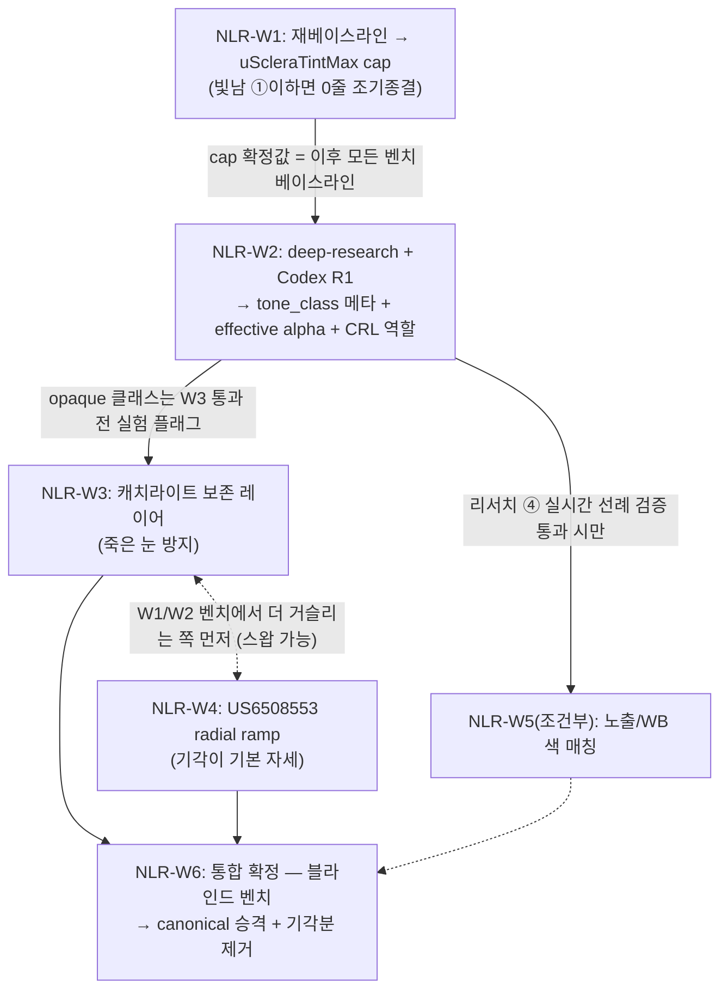

# NLR 트랙 — 렌즈 렌더링 자연스러움 개선 (Natural Lens Rendering)

> 로컬 초안 + Ultraplan 원격 정제본 병합 + **Codex 교차 검증(R0) 반영 완료** (2026-07-02).
> Codex 판정 "수정 필요 7건 반영 후 승인 가능" — 7건 전부 사실 검증(4건 코드/에셋 실측 확인) 후 본 문서에 반영됨.

## Context

렌즈 렌더링을 "보편적으로 쓰기 가장 최적인" 단일 기본값으로 확정하는 트랙. 현재 canonical(TintLinearV2, ID=5)은 휘도 보존 틴트로 홍채 중앙은 가장 자연스러우나 구조적 결함 3건이 확인됨:

1. **흰자·눈꺼풀 고휘도 과증폭(빛남)** — `shader_sources.cpp:349`의 `tinted = toLinearFast(blend) * lum * scale`에서 lum 무상한. 일반 실내(ema≈0.067)는 scale clamp 7.0 포화 영역이라 밝은 픽셀이 폭주. 실기기 관측(P6-W5/W9), 처방(비율 cap) 합의 완료·미착수.
2. **어두운 홍채에서 발색 실패** — 틴트(투과형)의 물리적 한계(US6761451). 치환형 CRL(ID=7)은 W5 벤치에서 잠정 불채택 후 역할 미확정.
3. **flat sticker 룩 / 죽은 눈(캐치라이트 소실)** — `docs/lenssim-handoff/natural-lens-fit-blending-research.md`(2026-06-11, 25클레임 3표 검증)가 해법 패턴(tone_class 분기 + effective alpha + 캐치라이트 분리 레이어 + radial ramp)을 제시했으나 전부 미구현.

프로세스: 재베이스라인(실기기) → 합의 완료분 즉시 구현 → 자료조사(deep-research) + **Codex 단독 교차 검증** → 후보 확정 → 후보별 구현·실기기 토글 벤치 → canonical 승격.

### 사용자 확정/가정 사항
- **교차 검증은 Codex 단독**(Gemini 제외) — tmux 팬 `3.1`(codex). `ar-lens-brainstorm` 스킬 패턴을 Codex-only로 축소 사용. [사용자 확정]
- P7-W4를 트랙 1번 작업(NLR-W1)으로 흡수. W 단위 순차 완결(구현→벤치→판정→다음). [권장안]
- 벤치 = 1인 실시간 토글 육안 체감(Galaxy S23+), 일반 실내 + 밝은 조명 2조건. 저조도 범위 외.

### 사전 검증 결과 (로컬 코드 재확인 완료)
- `feature/P7-W4-sclera-luma-atten` 브랜치 로컬 존재(문서만 2커밋: 브레인스토밍 R1 합의 + 재베이스라인 체크리스트) → develop 위로 rebase 후 재사용, `docs/bench/P7-W4/rebaseline_checklist.md` 그대로 사용.
- 구 P7-W4 처방(`P7-W0_index.md:148-173`)은 smoothstep attenuation(`uScleraAttenuation` 0.85)이었음 — 본 트랙은 신 합의안 **비율 cap**(`uScleraTintMax`)을 1차로 하고, 구 smoothstep 안은 cap 부족 시 soft-knee 폴백으로 강등. [브레인스토밍 synthesis와 정합 확인]
- internal C API 관례 확인: 벤치 토글은 `cpp/include/iris_sdk/internal/bench_toggles.h`에 선언(공개 sdk_api.h 미노출), "정식 활성 시 승격 검토" 주석 존재.
- ⚠️ **auto 센티널(-1) 차단 경로가 3중 (신규 발견 + Codex 확장 확인)**: `iris_jni.cpp:383-390`이 [0,7] 밖 blend ID를 ID5로 강제할 뿐 아니라, **Java `LensConfig.clamp()`가 [0,7]로 선행 클램프 + `Builder.build()`가 clamp 호출 + `isValid()` 범위 검사 + Kotlin `BlendMode.fromValue`(:107)**까지 전파됨. auto 도입 시 이 경로 전체가 한 커밋 세트.
- ⚠️ **데모 밝기 슬라이더 dead 확인 (신규 발견)**: `seekMaxDetail` → `CameraGLRenderer.maxDetailValue`(:252)는 설정만 되고 **소비처 0** (KT fallback 셰이더 소멸 잔재). native `uMaxDetail`은 1.25 하드코드(`gpu_lens_renderer.cpp:1151`). W2 C4 sweep을 위해 native setter 신설 + 슬라이더 재배선(또는 제거) 필요.
- `restoreLensRenderState()`(GpuRenderActivity.kt:650-672) 복원 목록 = reflection 모드/강도, measuredLuma, detailReinject, eyelidMaskMode, 렌즈 텍스처/config/enabled뿐 — **gate threshold, blinkUpMs, scleraVetoMode 미복원 갭 확인**(maxDetail은 위 dead 이슈로 별도). **Sclera Protect 토글 상태도 지역 변수(:428)라 복원 불가 구조** (Codex 지적, 코드 확인) — 필드 승격 필요.
- ⚠️ **렌즈 에셋 알파 실측 (Codex 지적 → 직접 실측 확인)**: claset 4종 avg alpha 0.13~0.38, 부분 알파(5~95%) 픽셀 10~18% — **커버리지가 이미 에셋 알파맵에 내장**되어 있고 셰이더는 `finalAlpha = lens.a × uOpacity × …`로 이를 소비 중. 리서치의 `effective_alpha = coverage × element_opacity`를 uOpacity에 그대로 곱하면 **이중 감쇄**. → W2 수식 재정의(아래).

### 하드 제약 (기각 이력 — 재제안 금지)
셰이더 절차 림발(에셋 책임, P6-W7 확정) · 외곽 광택 Fresnel(물리 오류) · 저조도 정교화 · 최종 사용자 수동 블렌드 선택 UI(데모 벤치 토글은 허용) · eye_opening 기반 alpha-fade · 환경 반사 재개(Phase 9 이월 유지).

---

## W 분할 및 순서



| W | 내용 | 게이트(종료 조건) |
|---|---|---|
| **NLR-W1** | C1: 재베이스라인 → TintLinearV2 비율 cap(`uScleraTintMax`, 초기 1.275) | 재베이스라인에서 빛남 ①이하면 0줄 조기종결(단 **조기종결이어도 cap은 W3/W6 회귀 체크리스트의 fallback 후보로 유지** — W2 CRL 전환·W3 캐치라이트가 빛남을 재유발할 수 있음). 구현 시: 빛남 개선 + 무회귀 + "경계 평탄화/하이라이트 칙칙함" 육안 기록(→W3 입력). 부족 시 soft-knee(구 smoothstep 안) → Spike-A(Oklab) 진입점 명시 |
| **NLR-W2** | 자료조사(갭 6주제) + Codex 교차 R1 → C2: SKU `tone_class` 메타 + effective alpha + CRL 역할 부여. C4(show-through)는 CRL detail 지수/하한 벤치 축으로 흡수 | **판정 항목 분해**: ① 파서/메타 확장 무회귀, ② auto 진입점 동작, ③ CRL α sweep 체감, ④ tone_class 라벨 품질 — 각각 독립 판정(실패 원인 분해 가능하게). 4클래스 대표 SKU에서 auto 모드가 canonical 고정 대비 동등 이상 + 어두운 홍채 발색 개선. tint/clear 정식, **natural은 W3 전 잠정 채택**(low-α CRL도 캐치라이트 손실 가능), **opaque는 W3 통과 전 실험 플래그** |
| **NLR-W3** | C5: 캐치라이트 보존 레이어 — **iris/lens 마스크 내 한정 + local residual(예: baseL−localBlur) 방식과 absolute threshold 방식 비교 + 재합성 상한(cap)**으로 W1 cap 우회 금지 | 죽은 눈 개선 체감 + 빛남 재유발 없음(W1 cap과 상호작용 확인). 통과 시 opaque·natural 정식 활성 |
| **NLR-W4** | C3: radial ramp — **범위를 alpha/pupil/edge 전이 완화로 한정. 절차적 색 darkening·림발 cue 생성 금지**(P6-W7 에셋 책임 원칙과의 경계 명문화) | ON/OFF 벤치에서 경계 점프 감소 체감 시만 채택, 미미하면 기각이 기본 자세. **미착수/기각이어도 W6 진행 가능** |
| **NLR-W5** (조건부) | C6: 노출/WB 색 매칭 — **exposure-only와 chroma(WB) 분리 벤치**. ROI는 홍채 단독이 아니라 피부/흰자/장면 확장 검토(홍채 고유색↔조명색 교락 방지) | 진입 조건 2중: W2 리서치의 실시간 선례 검증 통과 **AND W2~W4 벤치에서 노출/WB 불일치가 실제 실패로 관찰**. 비용 대비 이득 부족 시 이월 |
| **NLR-W6** | 통합 확정: 최종 블라인드 벤치 → canonical 조합 확정, 기각 후보 코드/uniform 제거, ID7 지위 확정(tone_class auto 전용), 블렌드 드롭다운 정리 | 단일 기본값 확정 + 토글 정리 + P7-W5 cross-tier 회귀 연계 |

순서 근거: cap(W1)이 이후 모든 벤치의 베이스라인 → tone_class(W2)가 CRL 지위를 결정 → opaque는 캐치라이트 보존(W3) 없인 죽은 눈 확정이므로 W3이 opaque의 게이트.

---

## NLR-W1 구현 (C1: sclera tint cap) — 앵커 전부 코드 검증 완료

브랜치: `feature/P7-W4-sclera-luma-atten`을 develop 위로 rebase 후 재사용.

**0단계 — 재베이스라인**: `docs/bench/P7-W4/rebaseline_checklist.md`대로 SKU 6종 × 2조명 현재 상태 확인. 빛남 ①이하면 코드 0줄 조기종결. 일반 실내(ema≈0.067)는 scale clamp 7.0 포화 영역이라 빛남 잔존 가능성 높음을 전제.

**7단 배선** — 기존 gate threshold 토글 체인(B9)을 1:1 복제. 각 단의 복제 원본:

1. **셰이더** `cpp/src/gpu/shader_sources.cpp`: `uniform float uScleraTintMax;` 추가 + `blendTintLinearV2`(:345-352)의 :349를
   ```glsl
   float tintMul = min(lum * scale, uScleraTintMax);
   vec3 tinted = toLinearFast(blend) * tintMul;
   ```
   OFF = 센티널 1e6 (lum≤1.0, scale clamp≤7.0이라 lum*scale≤7.0 → min 항등 → **비트 동일 출력 보장**, 분기 없음·uniform 값만이라 Adreno §8.9 리스크 0)
2. **헤더** `cpp/include/iris_sdk/gpu/gpu_lens_renderer.h`: `LensUniforms`에 `GLint uScleraTintMax = -1;`(uGateThreshold 옆) + 멤버 `float sclera_tint_max_ = 1.275f;`(gate_threshold_ 옆, 기본값 근거: P7-W2 실측 밝은 조명 scale=1.27) + `void setScleraTintMax(float v);` 선언
3. **구현** `cpp/src/gpu/gpu_lens_renderer.cpp`: `cacheLensUniforms()` location 등록, setter는 `setGateThreshold`(:633) 패턴(mutex + `std::clamp(v, 1.0f, 1e6f)`), `renderToTexture`의 uAvgIrisLum 업로드(:1247) 직후 `glUniform1f`
4. **C API** `cpp/src/sdk_api_v2.cpp`: `iris_sdk_set_lens_gate_threshold`(:794-803) 패턴으로 `iris_sdk_set_lens_sclera_tint_max`. 선언은 `cpp/include/iris_sdk/internal/bench_toggles.h`(gate 계열 옆) — 벤치 전용 internal 관례
5. **JNI** `android/iris-sdk/src/main/cpp/iris_jni.cpp`: `nativeSetScleraTintMax`(:2176-2184 nativeSetGateThreshold 패턴)
6. **Java** `android/iris-sdk/src/main/java/com/irislenssdk/IrisLensSDK.java`: `setScleraTintMax`(:1011 setGateThreshold 패턴) + native 선언
7. **Kotlin** `android/demo-app/src/main/java/com/irislenssdk/demo/camera/gpu/CameraGLView.kt`: queueEvent 브리지(:334-337 패턴) + 데모 `GpuRenderActivity.kt`: cap sweep 사이클 버튼 `{1.275, 1.5, 2.0, OFF(1e6)}`(btnW6Gate 패턴)

**DoD**:
- `restoreLensRenderState()`(GpuRenderActivity.kt:650-672)에 신규 cap 복원 등재 필수. **기존 갭 함께 보수(4종)**: gate threshold, blinkUpMs, scleraVetoMode 미복원 + **Sclera Protect는 지역 변수(:428)라 필드 승격 후 복원 등재** — 컨텍스트 재생성 시 벤치 상태가 어긋나는 원인이므로 W1에서 일괄 보수
- SDK surface 일관성: C++/JNI/Java/Kotlin 기본값·clamp 규약 일치(clamp는 C++ setter 단일 책임 관례), desktop stub(`IRIS_SDK_HAS_GLES` off) 빌드 통과(sdk_api_v2.cpp `#else (void)` 분기)

## NLR-W2 구현 스케치 (C2: tone_class)

⚠️ **함정(코드 확인 완료)**: `cpp/src/lens_sku_metadata.cpp:133-134` `parseObject`가 미지 키를 하드 거부(`return false`)하고 `loadFromJson`은 all-or-nothing — JSON에 `tone_class`를 먼저 넣으면 **42종 메타 로드 전체 실패**. 파서는 현재 string/bool 값만 지원(숫자 파싱 없음). **커밋 순서 강제: 파서 확장(+단위 테스트) → JSON 확장.**

1. **파서** `lens_sku_metadata.cpp`: `parseNumber` 헬퍼 신규 + `tone_class`(문자열→enum, 미지 값 Tint 폴백)/`coverage`/`element_opacity` 파싱. **unknown-key skip(forward-compat)** 도입 — 스칼라 값만 건너뛰고 중첩 객체/배열은 여전히 거부(파서 단순성 유지)
2. **구조체** `cpp/include/iris_sdk/lens_sku_metadata.h`: `enum class LensToneClass { Tint, Natural, Opaque, Clear }` + 필드(기본 coverage 0.25, element_opacity 0.9 — 리서치 §2.2 값)
3. **단위 테스트** 신규 `cpp/tests/test_lens_sku_metadata.cpp` + `cpp/tests/CMakeLists.txt` 등록(test_lens_renderer 패턴). round-trip/미지키/폴백 케이스 커버
4. **JSON** `android/demo-app/src/main/assets/lens_meta.json`(42 SKU): 벤치 SKU 정밀 라벨 + 나머지 오프라인 휴리스틱, 누락 시 tint 폴백(현행 동작 보존)
5. **렌더러**: `loadLensTexture`(gpu_lens_renderer.cpp:242)에서 SKU 메타 1회 해석·캐시 — 현재 `(void)sku_id; (void)sku_registry_;`(:258-259)로 보존된 주입점 그대로 활용(레지스트리 배선은 P6-W7에서 완료: sdk_api_v2.cpp:514/:557-583) → `renderToTexture`에서 모드+α 유도: tint→ID5+config.opacity(현행) / natural→ID7 / opaque→ID7(실험 플래그) / clear→스킵. **effective alpha 재정의(Codex 지적, 에셋 실측 확인)**: 에셋 알파맵이 이미 커버리지를 내장하므로 `coverage × element_opacity`를 uOpacity에 그대로 곱하지 않는다 — **coverage 메타는 분류/분석용, 렌더 α는 lens.a(에셋) × element_opacity 기반**으로 설계. α 유도값은 uOpacity 오버라이드로 적용(기존 feather/eyelid/veto 체인 그대로 통과), 리서치의 α 0.2~0.5/0.7~0.9 구간은 "최종 체감 α" 목표치로서 벤치 sweep의 기준으로만 사용
6. **auto 메커니즘 (W2 Codex R1 결정 쟁점)**: auto 발동은 명시 blend 미지정 시에만. 두 옵션 중 택1 — (a) `IRIS_BLEND_AUTO = -1` enum 도입 + **차단 경로 전체를 한 커밋에 수정**(C enum `sdk_api.h:134-143` + JNI `copyConfigFromJava`(:383-390) + Java `LensConfig` isValid/clamp/Builder.build + Kotlin `BlendMode.fromValue`), (b) `LensConfig`에 별도 auto 필드 추가(blend 검증 로직 무접촉, 단 FFI struct 레이아웃 변경). 데모 스피너 `blendModeEntries`에 "Auto" 추가(값 기반 역조회 관례 유지). 최종 사용자 수동 선택 금지 제약과 무충돌(데모 벤치 UI 허용 범위)
7. **C4 흡수**: show-through는 CRL의 detail 지수(현행 0.7)/하한(clamp 0.75)/uMaxDetail을 벤치 축으로 sweep. **선행 정리**: uMaxDetail은 native 하드코드 1.25(:1151)이고 데모 밝기 슬라이더는 dead(사전 검증 발견) — native setter 신설 + 슬라이더 재배선

## NLR-W3~W6 (요약)

- **W3 (C5)**: base 고휘도 성분(캐치라이트) 추출→블렌드 결과 위 재합성. **iris/lens 마스크 내 한정 + 재합성 상한으로 W1이 막은 sclera/eyelid 빛남 재유발 차단**. 방식은 absolute threshold vs local residual(baseL−localBlur) 비교를 W2 리서치 ②로 사전 검증. 기존 셰이더 인자만 재사용(신규 texture fetch 0 — camera.rgb는 이미 fetch됨). 참고: uHighlightEnabled는 P5-W3-05에서 제거된 이력 있음(고정 위치 오버레이와 달리 base 실측 캐치라이트의 residual 재합성임을 workPaper에 명시, env-map/Fresnel 경로 재사용 금지)
- **W4 (C3)**: 순수 ALU radial ramp. 채택 시에도 uniform 1~2개 이내
- **W5 (C6)**: avg_iris_luma 인프라(P7-W2, 실측 default ON)의 RGB 확장. 진입 조건 미충족 시 이월
- **W6**: 최종 블라인드 벤치(benchCombos 재정의) → canonical 확정, 기각 uniform/코드 일괄 제거, 드롭다운 정리

## 벤치 설계

- 인프라 재사용: `benchCombos` 블라인드 A/B/C/D(GpuRenderActivity.kt:516-555, 값 기반 역조회 관례 준수) W별 재정의, `scripts/build_and_install.sh`로 빌드·설치
- SKU: 누드 애쉬 로제(빛남 최강)/런웨이 그레이/샤모 그래픽/돌 초코(대조군) + W2부터 natural·opaque 대표 각 1종
- 판정: ⓪~③ 4단 스케일 + 자유 기술(정량 점수화 지양), W별 앵커 질문 고정 — W1 "빛남/칙칙함", W2 "스티커 룩/어두운 홍채 발색", W3 "죽은 눈", W4 "경계 점프". 기록 `docs/bench/NLR-W*/`
- 회귀 가드: 각 W 종료 시 기존 5모드(0/1/2/5/7) 수동 스핀 1회

## 자료조사 (NLR-W2 진입 시, deep-research 스킬)

기존 리서치가 못 덮은 갭 6주제: ① tone_class 오프라인 자동 분류 방법론(텍스처 통계 — detectBakedLimbal 확장 선례), ② 캐치라이트/글로스 보존 수식 선례(고휘도 추출 임계·재합성 공간 — C5 물리 가정 사전 검증), ③ effective alpha 균일 근사의 지각 한계(도트 masking effect), ④ 실시간 노출/WB 매칭 선례(C6 go/no-go), ⑤ 어두운 홍채 실착용 레퍼런스 사진(벤치 육안 앵커), ⑥ (선택) Adreno 7xx 동적 분기 비용.

리서치 결과 + 후보 매트릭스를 **Codex 교차 R1**(tmux 팬 3.1, 텍스트/Enter 분리 송신)로 검토 후 §5 확정 — 물리 가정 정합성("현실 발생 사례 vs 구현") 명시 비교 포함.

## 리스크와 완화

| 리스크 | 완화 |
|---|---|
| Adreno non-uniform 분기 내 implicit-LOD 사고(이력 2회 — P7-W1 0x501) | 신규 코드는 uniform 분기만, 조건부 texture fetch 금지. C5는 기존 인자 재사용(신규 fetch 0), C3는 순수 ALU. W1 cap은 min()이라 분기 자체가 없음 |
| uniform 수 증가(이미 40+) | 신규 스칼라 vec4 패킹 우선, W6에서 기각분 일괄 제거 |
| EGL 복원 누락으로 벤치 중 상태 어긋남 | 신규 native 상태마다 `restoreLensRenderState()` 등재를 W별 DoD 항목화 (W1에서 기존 3종 갭도 일괄 보수) |
| 기존 5모드 회귀 | cap OFF=비트 동일, tone_class 누락=tint 폴백=현행 동작, auto 미선택 시 현행 경로 무변경 |
| cap↔tone_class 벤치 교락 | W1 판정 전 W2 착수 금지, W2 벤치는 cap 확정값 고정 |
| 파서 확장이 42종 메타 로드를 깨뜨림 | 커밋 순서 강제(파서+테스트 → JSON) + round-trip 단위 테스트 + 로드 실패 시 registry 미갱신(현행 loadFromJson 시맨틱) 확인 |

## 검증 방법

1. **빌드**: `cd cpp/cmake-build-debug && cmake .. -DIRIS_SDK_FETCH_TFLITE=OFF && cmake --build . --parallel && ctest`(신규 test_lens_sku_metadata 포함, 새 빌드 디렉토리 생성 금지) + `scripts/build_and_install.sh`(데모 APK)
2. **실기기**(S23+): 렌즈 선택 후 `Lens applied` 로그 확인 → W별 토글 sweep 육안 벤치(2조명) → `dumpsys meminfo` 10분 회귀 체크
3. **판정 기록**: `docs/bench/NLR-W*/` 체크리스트 + 각 W 종료 시 workPaper 문서 업데이트(작업 규칙)

## 작업 규칙 준수

- 각 W마다 `docs/workPaper/` 문서 생성·업데이트: 트랙 인덱스 `NLR-W0_index.md` 신설, W1 문서는 `P7-W4_sclera_luma_attenuation.md` 승계
- `cpp/` 작업은 systems-programming:cpp-pro 에이전트와 함께
- 커밋: Conventional Commits 접두사 영문 + 설명 한글, W 단위 분할 커밋 → develop 직접 머지(내부 통합은 PR 생략, `--no-ff`)
