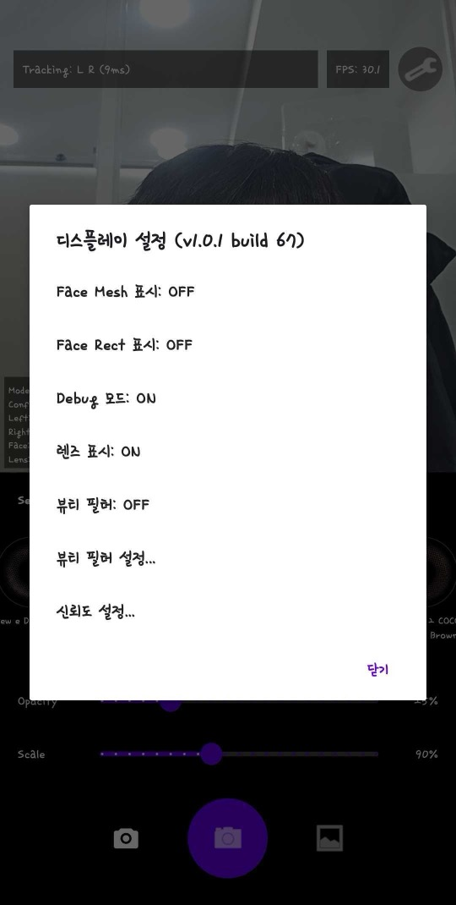
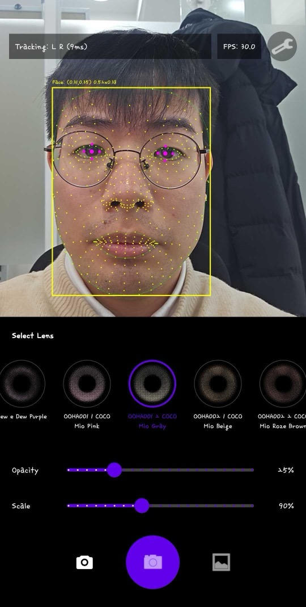
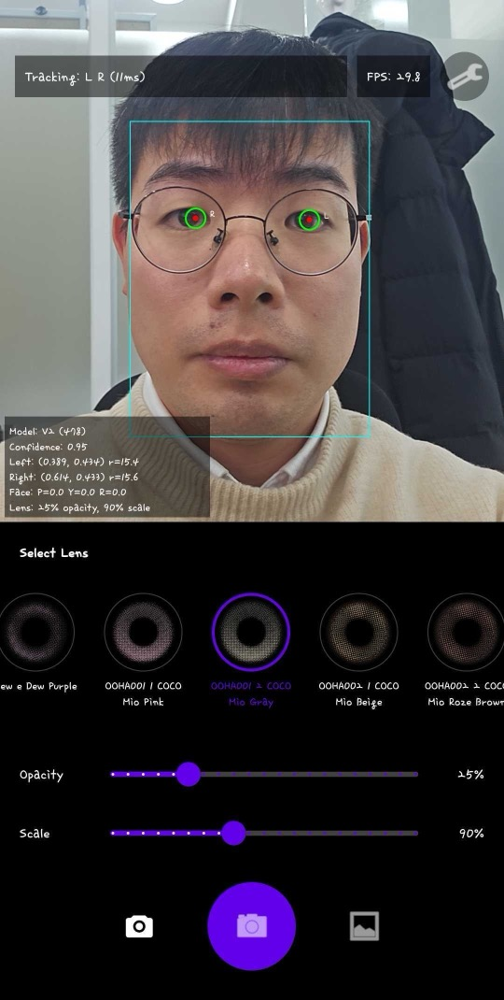

# IrisLensSDK 기능 및 성과 보고서

## 1. 프로젝트 개요

| 항목 | 내용 |
|------|------|
| **프로젝트명** | IrisLensSDK |
| **목적** | 실시간 AR 렌즈 피팅 SDK |
| **타겟 플랫폼** | Android, iOS, Flutter, Web |
| **현재 상태** | Android 데모 앱 개발 완료 |

---

## 2. 구현된 핵심 기능

### 2.1 실시간 홍채 추적

**기능 설명**
- 실시간 카메라 영상에서 양쪽 눈의 홍채 중심점과 크기 검출
- 478개 얼굴 랜드마크 기반 정밀 추적
- 다양한 조명 환경에서 안정적 동작

**기술 사양**
| 항목 | 수치 |
|------|------|
| 검출 프레임레이트 | 60fps |
| 지원 해상도 | 1080p (1920×1080) |
| 검출 범위 | 전면/후면 카메라 |

---

### 2.2 가상 렌즈 오버레이

**기능 설명**
- 다양한 디자인의 컬러렌즈 실시간 착용 미리보기
- 홍채 크기에 맞춰 자동 스케일링
- 자연스러운 투명도 블렌딩

**지원 렌즈 설정**
- 왼쪽/오른쪽 독립 적용
- 렌즈 크기 조절 (0.5x ~ 2.0x)
- 커스텀 렌즈 이미지 지원 (PNG)

---

### 2.3 디버그 시각화 (개발용)

**기능 설명**
- Face Mesh 478개 랜드마크 시각화
- 홍채 중심점 및 반경 표시
- 눈 윤곽 클리핑 영역 확인

---

## 3. C++ 코어 엔진 테스트 결과

SDK 코어 엔진의 정확도 검증을 위해 다양한 테스트 이미지로 검증을 수행했습니다.

### 3.1 렌즈 렌더링 테스트

**입력 이미지**

**렌즈 적용 결과**

### 3.2 다양한 각도 테스트

정면, 측면, 상하 각도에서 모두 안정적인 홍채 검출 및 렌즈 렌더링을 확인했습니다.

---

## 4. 성능 최적화 성과

### 4.1 렌더링 파이프라인 최적화

| 최적화 항목 | 이전 | 이후 | 개선율 |
|-------------|------|------|--------|
| 검출 주기 | 33ms (30fps) | 16ms (60fps) | **2배** |
| 이미지 변환 | 50~100ms | 5~10ms | **10배** |

### 4.2 사용자 경험 개선

| 항목 | 이전 | 이후 |
|------|------|------|
| 렌즈 반응 속도 | ~1초 지연 | 즉각 반응 |
| 좌표 떨림 | 눈에 띄는 지터링 | 부드러운 추적 |
| 렌즈 깜빡임 | 빈번한 깜빡임 | 안정적 유지 |

### 4.3 기술적 개선

**One-Euro Filter 적용**
- 느린 움직임: 강한 스무딩 → 지터링 제거
- 빠른 움직임: 약한 스무딩 → 즉각 반응

**렌즈 지속성 개선**
- 검출 실패 시에도 2초간 마지막 위치 유지
- Mesh와 독립적인 렌즈 렌더링

---

## 5. 데모 앱 기능

### 5.1 주요 화면

- 실시간 카메라 프리뷰
- 렌즈 피팅 오버레이
- 성능 정보 표시 (FPS, 검출 시간)

### 5.2 설정 옵션

| 설정 | 설명 |
|------|------|
| 렌즈 선택 | 다양한 렌즈 디자인 선택 |
| 디버그 모드 | Face Mesh, 홍채 마커 표시 |
| 눈 클리핑 | 눈 영역 마스킹 ON/OFF |

### 5.3 지원 렌즈 종류

- 내추럴 브라운
- 그레이
- 블루
- 그린
- 커스텀 (사용자 이미지)

---

## 6. 기술 스택

### 6.1 핵심 기술

| 기술 | 버전 | 용도 |
|------|------|------|
| MediaPipe | 0.10.x | 얼굴/홍채 AI 검출 |
| TensorFlow Lite | 2.x | 온디바이스 ML 추론 |
| OpenCV | 4.x | 이미지 처리 |
| C++ | 17 | 코어 엔진 |

### 6.2 플랫폼별 기술

| 플랫폼 | 바인딩 | 결과물 |
|--------|--------|--------|
| Android | JNI | AAR 라이브러리 |
| iOS | Objective-C++ | XCFramework |
| Flutter | dart:ffi | Plugin |
| Web | Emscripten | WASM |

---

## 7. 향후 계획

### 단기 (1~2개월)
- [ ] iOS 버전 개발
- [ ] Flutter 플러그인 개발
- [ ] 추가 렌즈 디자인 지원

### 중기 (3~6개월)
- [ ] Web (WASM) 버전 개발
- [ ] GPU 가속 최적화
- [ ] 눈 전용 AI 모델 개발 (정확도 향상)

### 장기 (6개월+)
- [ ] AR 메이크업 기능 확장
- [ ] 3D 렌즈 렌더링
- [ ] 클라우드 렌즈 카탈로그 연동

---

*작성일: 2025년 1월*
