# Phase 1 구현 워크플로우

**버전**: 1.0
**생성일**: 2026-01-07
**마스터 문서**: [000_phase1_plan.md](000_phase1_plan.md)

---

## 개요

Phase 1의 상세 구현 워크플로우입니다. 각 태스크는 독립적으로 추적 가능하며, 의존성에 따라 순차 또는 병렬로 실행됩니다.

**목표**: Desktop 코어 엔진 + Android 바인딩 완성
**기간**: 6주
**태스크 수**: 26개

---

## 태스크 문서화 프로세스

### 필수 규칙

**모든 태스크는 개별 문서를 생성하여 실행 계획 수립 → 실행 → 결과 기록까지 완전히 문서화해야 합니다.**

### 문서 명명 규칙

```
P1-Wx-xx_작업명.md
예: P1-W3-01_iris_detector_interface.md
```

### 문서 구조 (필수 섹션)

```markdown
# P1-Wx-xx: 태스크명

**태스크 ID**: P1-Wx-xx
**상태**: ⏳ 대기 | 🔄 진행중 | ✅ 완료
**시작일**: YYYY-MM-DD
**완료일**: YYYY-MM-DD

---

## 1. 계획
### 목표
(이 태스크가 달성해야 할 구체적 목표)

### 산출물
(생성되어야 할 파일, 코드, 문서 목록)

### 검증 기준
(완료 판단 기준, 테스트 항목)

### 선행 조건
(의존하는 다른 태스크 또는 환경)

---

## 2. 분석
(태스크 수행을 위한 기술적 분석, 설계 결정사항)

---

## 3. 실행 내역
### 3.1 [단계명]
(실제 실행한 명령어, 코드, 작업 내용)

### 3.2 [단계명]
...

---

## 4. 검증 결과

### 검증 항목

| 항목 | 결과 | 비고 |
|------|------|------|
| ... | ✅/❌/⚠️ | ... |

---

## 5. 이슈 및 학습

### 이슈
| ID | 내용 | 상태 | 해결방안 |
|----|------|------|----------|

### 결정 사항
| 결정 | 이유 |
|------|------|

### 학습 내용
(기술적으로 배운 점, 향후 참고할 내용)

---

## 변경 이력

| 날짜 | 변경 내용 |
|------|----------|
```

### 워크플로우 절차

```
1. 태스크 시작 전
   └─ 문서 생성 (상태: ⏳ 대기)
   └─ 1. 계획 섹션 작성
   └─ 2. 분석 섹션 작성

2. 태스크 실행 중
   └─ 상태 변경 (🔄 진행중)
   └─ 3. 실행 내역 실시간 기록
   └─ 이슈 발생시 즉시 기록

3. 태스크 완료 후
   └─ 4. 검증 결과 기록
   └─ 5. 이슈 및 학습 정리
   └─ 상태 변경 (✅ 완료)
   └─ 워크플로우 체크리스트 업데이트
```

### 참고 문서

#### M1: 환경 구축 (완료)

| 태스크 | 문서 |
|--------|------|
| P1-W1-01 | [P1-W1-01_directory_structure.md](P1-W1-01_directory_structure.md) |
| P1-W1-02 | [P1-W1-02_cmake_setup.md](P1-W1-02_cmake_setup.md) |
| P1-W1-03 | [P1-W1-03_mediapipe_setup.md](P1-W1-03_mediapipe_setup.md) |
| P1-W1-04 | [P1-W1-04_opencv_setup.md](P1-W1-04_opencv_setup.md) |
| P1-W2-01 | [P1-W2-01_dependency_test.md](P1-W2-01_dependency_test.md) |
| P1-W2-02 | [P1-W2-02_desktop_build.md](P1-W2-02_desktop_build.md) |
| P1-W2-03 | [P1-W2-03_android_ndk.md](P1-W2-03_android_ndk.md) |
| P1-W2-04 | [P1-W2-04_android_crosscompile.md](P1-W2-04_android_crosscompile.md) |

#### M2: 코어 엔진 (작업 문서 준비 완료)

| 태스크 | 문서 | 설명 |
|--------|------|------|
| P1-W3-01 | [P1-W3-01_iris_detector_interface.md](P1-W3-01_iris_detector_interface.md) | IrisDetector 인터페이스 |
| P1-W3-02 | [P1-W3-02_data_structures.md](P1-W3-02_data_structures.md) | 데이터 구조 정의 |
| P1-W3-03 | [P1-W3-03_mediapipe_detector.md](P1-W3-03_mediapipe_detector.md) | MediaPipeDetector 구현 |
| P1-W3-04 | [P1-W3-04_detector_unit_test.md](P1-W3-04_detector_unit_test.md) | 검출기 단위 테스트 |
| P1-W4-01 | [P1-W4-01_lens_renderer.md](P1-W4-01_lens_renderer.md) | LensRenderer 기본 구현 |
| P1-W4-02 | [P1-W4-02_blending_algorithm.md](P1-W4-02_blending_algorithm.md) | 블렌딩 알고리즘 |
| P1-W4-03 | [P1-W4-03_frame_processor.md](P1-W4-03_frame_processor.md) | FrameProcessor 파이프라인 |
| P1-W4-04 | [P1-W4-04_sdk_manager.md](P1-W4-04_sdk_manager.md) | SDKManager 싱글톤 |
| P1-W4-05 | [P1-W4-05_c_api_wrapper.md](P1-W4-05_c_api_wrapper.md) | C API 래퍼 |
| P1-W4-06 | [P1-W4-06_integration_test.md](P1-W4-06_integration_test.md) | 코어 통합 테스트 |

---

## 마일스톤 체크리스트

### M1: 환경 구축 (Week 1-2) ✅ 완료
- [x] P1-W1-01: 프로젝트 디렉토리 구조 ✅
- [x] P1-W1-02: CMakeLists.txt 루트 설정 ✅
- [x] P1-W1-03: MediaPipe 사전빌드 설정 ✅ (TFLite 기반)
- [x] P1-W1-04: OpenCV 사전빌드 설정 ✅
- [x] P1-W2-01: 의존성 통합 테스트 ✅
- [x] P1-W2-02: Desktop 빌드 검증 ✅ (libiris_sdk.dylib)
- [x] P1-W2-03: Android NDK 환경 설정 ✅
- [x] P1-W2-04: Android 크로스컴파일 테스트 ✅ (libiris_sdk.so)

### M2: 코어 엔진 (Week 3-4)
- [ ] P1-W3-01: IrisDetector 인터페이스 정의
- [ ] P1-W3-02: 데이터 구조 정의 (IrisResult, LensConfig)
- [ ] P1-W3-03: MediaPipeDetector 구현
- [ ] P1-W3-04: 검출기 단위 테스트
- [ ] P1-W4-01: LensRenderer 기본 구현
- [ ] P1-W4-02: 블렌딩 알고리즘 구현
- [ ] P1-W4-03: FrameProcessor 파이프라인
- [ ] P1-W4-04: SDKManager 싱글톤
- [ ] P1-W4-05: C API 래퍼 구현
- [ ] P1-W4-06: 코어 통합 테스트

### M3: 데스크톱 실시간 처리 (Week 4 말)
- [ ] 웹캠 실시간 처리 30fps 달성

### M4: Android MVP (Week 5-6)
- [ ] P1-W5-01: JNI 래퍼 구현
- [ ] P1-W5-02: Kotlin SDK 클래스
- [ ] P1-W5-03: Gradle/CMake 통합
- [ ] P1-W5-04: AAR 빌드 설정
- [ ] P1-W6-01: 데모 앱 UI
- [ ] P1-W6-02: CameraX 연동
- [ ] P1-W6-03: 실기기 성능 테스트
- [ ] P1-W6-04: 최종 검증 및 문서화

---

## 의존성 다이어그램

```mermaid
graph TD
    subgraph "Week 1-2: 환경 설정"
        W1_01[P1-W1-01<br/>디렉토리 구조]
        W1_02[P1-W1-02<br/>CMakeLists.txt]
        W1_03[P1-W1-03<br/>MediaPipe 설정]
        W1_04[P1-W1-04<br/>OpenCV 설정]
        W2_01[P1-W2-01<br/>의존성 통합]
        W2_02[P1-W2-02<br/>Desktop 빌드]
        W2_03[P1-W2-03<br/>NDK 설정]
        W2_04[P1-W2-04<br/>크로스컴파일]

        W1_01 --> W1_02
        W1_02 --> W1_03
        W1_02 --> W1_04
        W1_03 --> W2_01
        W1_04 --> W2_01
        W2_01 --> W2_02
        W2_02 --> W2_03
        W2_03 --> W2_04
    end

    subgraph "Week 3-4: 코어 엔진"
        W3_01[P1-W3-01<br/>IrisDetector I/F]
        W3_02[P1-W3-02<br/>데이터 구조]
        W3_03[P1-W3-03<br/>MediaPipeDetector]
        W3_04[P1-W3-04<br/>검출기 테스트]
        W4_01[P1-W4-01<br/>LensRenderer]
        W4_02[P1-W4-02<br/>블렌딩]
        W4_03[P1-W4-03<br/>FrameProcessor]
        W4_04[P1-W4-04<br/>SDKManager]
        W4_05[P1-W4-05<br/>C API]
        W4_06[P1-W4-06<br/>통합 테스트]

        W2_04 --> W3_01
        W3_01 --> W3_02
        W3_02 --> W3_03
        W3_03 --> W3_04
        W3_02 --> W4_01
        W4_01 --> W4_02
        W3_04 --> W4_03
        W4_02 --> W4_03
        W4_03 --> W4_04
        W4_04 --> W4_05
        W4_05 --> W4_06
    end

    subgraph "Week 5-6: Android"
        W5_01[P1-W5-01<br/>JNI 래퍼]
        W5_02[P1-W5-02<br/>Kotlin SDK]
        W5_03[P1-W5-03<br/>Gradle/CMake]
        W5_04[P1-W5-04<br/>AAR 빌드]
        W6_01[P1-W6-01<br/>데모 UI]
        W6_02[P1-W6-02<br/>CameraX]
        W6_03[P1-W6-03<br/>성능 테스트]
        W6_04[P1-W6-04<br/>최종 검증]

        W4_06 --> W5_01
        W5_01 --> W5_02
        W5_02 --> W5_03
        W5_03 --> W5_04
        W5_04 --> W6_01
        W6_01 --> W6_02
        W6_02 --> W6_03
        W6_03 --> W6_04
    end
```



---

## 태스크 상세

### Week 1: 프로젝트 기반 설정

#### P1-W1-01: 프로젝트 디렉토리 구조 생성
| 항목 | 내용 |
|------|------|
| **설명** | 전체 프로젝트 디렉토리 구조 생성 |
| **의존성** | 없음 (시작 태스크) |
| **산출물** | cpp/, shared/, android/, scripts/ 디렉토리 |
| **검증 기준** | 모든 디렉토리 존재, .gitkeep 파일 배치 |
| **예상 소요** | 1시간 |

#### P1-W1-02: CMakeLists.txt 루트 설정
| 항목 | 내용 |
|------|------|
| **설명** | 루트 CMakeLists.txt 및 cpp/ CMake 설정 |
| **의존성** | P1-W1-01 |
| **산출물** | CMakeLists.txt, cpp/CMakeLists.txt |
| **검증 기준** | `cmake ..` 성공 (의존성 없이) |
| **예상 소요** | 2시간 |

#### P1-W1-03: MediaPipe 사전빌드 설정
| 항목 | 내용 |
|------|------|
| **설명** | MediaPipe 사전빌드 라이브러리 다운로드 및 CMake 연동 |
| **의존성** | P1-W1-02 |
| **산출물** | cpp/third_party/mediapipe/, FindMediaPipe.cmake |
| **검증 기준** | MediaPipe 헤더 include 가능 |
| **예상 소요** | 4시간 |
| **리스크** | 사전빌드 호환성 문제 → 직접 빌드 필요 가능 |

#### P1-W1-04: OpenCV 사전빌드 설정
| 항목 | 내용 |
|------|------|
| **설명** | OpenCV 4.x 사전빌드 라이브러리 설정 |
| **의존성** | P1-W1-02 |
| **산출물** | cpp/third_party/opencv/, OpenCV 링크 설정 |
| **검증 기준** | OpenCV 헤더 include 및 링크 가능 |
| **예상 소요** | 2시간 |
| **병렬 가능** | P1-W1-03과 병렬 실행 가능 |

### Week 2: 빌드 검증

#### P1-W2-01: 의존성 통합 테스트
| 항목 | 내용 |
|------|------|
| **설명** | MediaPipe + OpenCV 통합 빌드 테스트 |
| **의존성** | P1-W1-03, P1-W1-04 |
| **산출물** | 통합 테스트 바이너리 |
| **검증 기준** | 두 라이브러리 함께 링크 성공 |
| **예상 소요** | 3시간 |

#### P1-W2-02: Desktop 빌드 검증
| 항목 | 내용 |
|------|------|
| **설명** | macOS/Linux Desktop 빌드 완전 검증 |
| **의존성** | P1-W2-01 |
| **산출물** | Desktop 공유 라이브러리 (.dylib/.so) |
| **검증 기준** | 라이브러리 로드 및 심볼 확인 |
| **예상 소요** | 2시간 |

#### P1-W2-03: Android NDK 환경 설정
| 항목 | 내용 |
|------|------|
| **설명** | Android NDK 설치 및 CMake 툴체인 설정 |
| **의존성** | P1-W2-02 |
| **산출물** | NDK 경로 설정, android.toolchain.cmake |
| **검증 기준** | NDK 버전 확인, 툴체인 파일 존재 |
| **예상 소요** | 2시간 |

#### P1-W2-04: Android 크로스컴파일 테스트
| 항목 | 내용 |
|------|------|
| **설명** | arm64-v8a 타겟 크로스컴파일 테스트 |
| **의존성** | P1-W2-03 |
| **산출물** | libiris_sdk.so (Android용) |
| **검증 기준** | .so 파일 생성, ABI 검증 |
| **예상 소요** | 4시간 |
| **리스크** | 의존성 크로스컴파일 이슈 가능 |

### Week 3: 코어 인터페이스

#### P1-W3-01: IrisDetector 인터페이스 정의
| 항목 | 내용 |
|------|------|
| **설명** | 홍채 검출기 추상 인터페이스 정의 |
| **의존성** | P1-W2-04 (환경 완료) |
| **산출물** | cpp/include/iris_sdk/iris_detector.h |
| **검증 기준** | 컴파일 성공, 인터페이스 문서화 |
| **예상 소요** | 2시간 |

```cpp
// 예상 인터페이스
class IrisDetector {
public:
    virtual ~IrisDetector() = default;
    virtual bool initialize(const std::string& model_path) = 0;
    virtual IrisResult detect(const cv::Mat& frame) = 0;
    virtual void release() = 0;
};
```

#### P1-W3-02: 데이터 구조 정의
| 항목 | 내용 |
|------|------|
| **설명** | IrisResult, LensConfig 등 핵심 데이터 구조 |
| **의존성** | P1-W3-01 |
| **산출물** | cpp/include/iris_sdk/types.h |
| **검증 기준** | 모든 필드 정의, 메모리 레이아웃 검증 |
| **예상 소요** | 2시간 |

#### P1-W3-03: MediaPipeDetector 구현
| 항목 | 내용 |
|------|------|
| **설명** | MediaPipe 기반 IrisDetector 구현체 |
| **의존성** | P1-W3-02 |
| **산출물** | mediapipe_detector.h/cpp |
| **검증 기준** | 정적 이미지에서 홍채 검출 성공 |
| **예상 소요** | 8시간 |

#### P1-W3-04: 검출기 단위 테스트
| 항목 | 내용 |
|------|------|
| **설명** | MediaPipeDetector 단위 테스트 작성 |
| **의존성** | P1-W3-03 |
| **산출물** | cpp/tests/test_iris_detector.cpp |
| **검증 기준** | 테스트 이미지 5종 통과, 정확도 95%+ |
| **예상 소요** | 4시간 |

### Week 4: 렌더링 및 통합

#### P1-W4-01: LensRenderer 기본 구현
| 항목 | 내용 |
|------|------|
| **설명** | 가상 렌즈 렌더링 기본 구현 |
| **의존성** | P1-W3-02 |
| **산출물** | lens_renderer.h/cpp |
| **검증 기준** | 정적 이미지에 렌즈 오버레이 성공 |
| **예상 소요** | 6시간 |
| **병렬 가능** | P1-W3-03과 병렬 진행 가능 |

#### P1-W4-02: 블렌딩 알고리즘 구현
| 항목 | 내용 |
|------|------|
| **설명** | 자연스러운 렌즈 블렌딩 (알파, 마스킹) |
| **의존성** | P1-W4-01 |
| **산출물** | 블렌딩 로직 추가 |
| **검증 기준** | 시각적 품질 검증, 경계 자연스러움 |
| **예상 소요** | 4시간 |

#### P1-W4-03: FrameProcessor 파이프라인
| 항목 | 내용 |
|------|------|
| **설명** | 검출→렌더링 통합 파이프라인 |
| **의존성** | P1-W3-04, P1-W4-02 |
| **산출물** | frame_processor.h/cpp |
| **검증 기준** | 단일 호출로 전체 처리, 33ms 이하 |
| **예상 소요** | 4시간 |

#### P1-W4-04: SDKManager 싱글톤
| 항목 | 내용 |
|------|------|
| **설명** | SDK 진입점 싱글톤 + Facade 구현 |
| **의존성** | P1-W4-03 |
| **산출물** | sdk_manager.h/cpp |
| **검증 기준** | 전역 접근, 라이프사이클 관리 |
| **예상 소요** | 3시간 |

#### P1-W4-05: C API 래퍼 구현
| 항목 | 내용 |
|------|------|
| **설명** | extern "C" API 래퍼 (바인딩용) |
| **의존성** | P1-W4-04 |
| **산출물** | sdk_api.h/cpp |
| **검증 기준** | C 호환 심볼 export, ABI 안정성 |
| **예상 소요** | 3시간 |

#### P1-W4-06: 코어 통합 테스트
| 항목 | 내용 |
|------|------|
| **설명** | 전체 코어 엔진 통합 테스트 |
| **의존성** | P1-W4-05 |
| **산출물** | cpp/tests/test_integration.cpp, 웹캠 데모 |
| **검증 기준** | 웹캠 30fps 실시간 처리 |
| **예상 소요** | 4시간 |

### Week 5: Android JNI

#### P1-W5-01: JNI 래퍼 구현
| 항목 | 내용 |
|------|------|
| **설명** | C API를 JNI로 래핑 |
| **의존성** | P1-W4-06 |
| **산출물** | android/iris-sdk/src/main/cpp/iris_jni.cpp |
| **검증 기준** | JNI 메서드 시그니처 검증 |
| **예상 소요** | 6시간 |

#### P1-W5-02: Kotlin SDK 클래스
| 항목 | 내용 |
|------|------|
| **설명** | Kotlin API 클래스 (IrisLensSDK, IrisResult) |
| **의존성** | P1-W5-01 |
| **산출물** | IrisLensSDK.kt, IrisResult.kt |
| **검증 기준** | Kotlin에서 네이티브 호출 성공 |
| **예상 소요** | 4시간 |

#### P1-W5-03: Gradle/CMake 통합
| 항목 | 내용 |
|------|------|
| **설명** | Android Gradle + CMake 빌드 통합 |
| **의존성** | P1-W5-02 |
| **산출물** | build.gradle.kts, CMakeLists.txt |
| **검증 기준** | `./gradlew assembleDebug` 성공 |
| **예상 소요** | 4시간 |

#### P1-W5-04: AAR 빌드 설정
| 항목 | 내용 |
|------|------|
| **설명** | AAR 라이브러리 패키징 설정 |
| **의존성** | P1-W5-03 |
| **산출물** | iris-sdk-release.aar |
| **검증 기준** | AAR 생성, 외부 프로젝트에서 import 가능 |
| **예상 소요** | 3시간 |

### Week 6: 데모 앱 및 최종 검증

#### P1-W6-01: 데모 앱 UI
| 항목 | 내용 |
|------|------|
| **설명** | Android 데모 앱 기본 UI |
| **의존성** | P1-W5-04 |
| **산출물** | demo-app 모듈 |
| **검증 기준** | 앱 실행, 카메라 프리뷰 표시 |
| **예상 소요** | 4시간 |

#### P1-W6-02: CameraX 연동
| 항목 | 내용 |
|------|------|
| **설명** | CameraX + SDK 실시간 연동 |
| **의존성** | P1-W6-01 |
| **산출물** | 실시간 렌즈 오버레이 동작 |
| **검증 기준** | 실시간 처리, 프레임 드랍 최소화 |
| **예상 소요** | 6시간 |

#### P1-W6-03: 실기기 성능 테스트
| 항목 | 내용 |
|------|------|
| **설명** | 다양한 Android 기기 성능 테스트 |
| **의존성** | P1-W6-02 |
| **산출물** | 성능 리포트 |
| **검증 기준** | 중급 기기 30fps, 고급 기기 60fps |
| **예상 소요** | 4시간 |
| **테스트 기기** | Galaxy S21+, Pixel 6, 중급 기기 1종 |

#### P1-W6-04: 최종 검증 및 문서화
| 항목 | 내용 |
|------|------|
| **설명** | Phase 1 최종 검증 및 문서 업데이트 |
| **의존성** | P1-W6-03 |
| **산출물** | 완료 보고서, README 업데이트 |
| **검증 기준** | 모든 마일스톤 완료, 문서 최신화 |
| **예상 소요** | 4시간 |

---

## 품질 게이트

### Gate 1: 환경 구축 완료 (Week 2 말)
- [ ] Desktop 빌드 성공
- [ ] Android 크로스컴파일 성공
- [ ] 의존성 라이브러리 정상 동작

### Gate 2: 코어 엔진 완료 (Week 4 말)
- [ ] 정적 이미지 검출 정확도 95%+
- [ ] 웹캠 실시간 30fps 달성
- [ ] C API 심볼 export 완료

### Gate 3: Android MVP 완료 (Week 6 말)
- [ ] AAR 패키지 생성
- [ ] 실기기 30fps 달성
- [ ] 데모 앱 정상 동작

---

## 리스크 및 대응

| 리스크 | 확률 | 영향 | 대응 전략 |
|--------|------|------|-----------|
| MediaPipe 사전빌드 호환 문제 | 중 | 높음 | 직접 빌드 or 대안 라이브러리 |
| Android 크로스컴파일 실패 | 중 | 높음 | Docker 빌드 환경 구축 |
| 실기기 성능 미달 | 중 | 중 | 모델 최적화, 해상도 조정 |
| JNI 메모리 누수 | 낮음 | 중 | LeakCanary 적용, 메모리 프로파일링 |

---

## 사용법

### 태스크 시작
```bash
# 000_phase1_plan.md의 진척도 업데이트
# 해당 태스크 상태를 🔄 진행중으로 변경
```

### 태스크 완료
```bash
# 체크리스트 체크: - [ ] → - [x]
# 000_phase1_plan.md 진척도 업데이트
# 이슈 발생시 이슈 트래킹에 기록
```

### 마일스톤 완료
```bash
# 품질 게이트 모든 항목 확인
# 000_phase1_plan.md 마일스톤 상태 업데이트
# 기반 지식에 학습 내용 기록
```

---

## 변경 이력

| 버전 | 날짜 | 변경 내용 |
|------|------|----------|
| 1.0 | 2026-01-07 | 초안 작성 |
