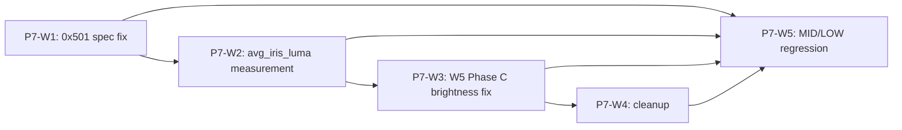

# Codex P7-W0 응답

작성일: 2026-06-04  
기준 문서: `docs/workPaper/P7-W0_brainstorm/00_brief.md` 전체  
범위: P7 계획 검토. P8 face slimming은 인지하되 P7 범위에 넣지 않는다.

## 1. Q1~Q4 답변

### Q1. 0x501 즉시 수정 vs 디바이스 매트릭스 회귀 우선

추천안: **(c) 둘 다 같은 W, 패치 먼저 + 회귀로 cross-tier 확인**.

근거: `cpp/src/gpu/shader_sources.cpp`의 `uDetailReinject` 분기 안 9회 `texture()`는 GLSL ES의 implicit derivative undefined 조건에 걸린다. Adreno 6xx/7xx에서 검은 화면으로 재현된다는 보장은 없지만, spec 위반 자체와 P6-W9의 0x501 잔재가 동시에 있으므로 "재현되면 고침"보다 먼저 제거하는 편이 맞다. 위험은 `textureLod(..., 0.0)` 또는 fetch hoist가 디테일 재주입의 샘플링 감각을 미세하게 바꿀 수 있다는 점이며, 그래서 같은 W 안에서 HIGH tier와 가능한 MID/LOW 확인을 묶어야 한다.

### Q2. W5 Phase C 알고리즘 선택

추천안: **(a) 단계적 접근: 기존 TintLinearV2 + luma-only 기반 sclera/휘도 attenuation 먼저, 효과 부족 시 Oklab/Laplacian PoC**.

근거: F1의 Oklab + multi-scale Laplacian은 방향성은 좋지만, 모바일 30fps 예산과 cube root/다중 패스 비용이 아직 비어 있다. P6 W5 Phase A/B에서 luma-only가 유력했으므로 color-veto를 되살리기보다 luma-only 판단을 TintLinearV2의 고휘도 과증폭 억제에 먼저 결합하는 편이 결정 흐름과 맞다. 이 단계가 SKU 6 같은 밝은 렌즈에서 부족할 때만 Oklab/Laplacian을 PoC로 올린다.

### Q3. W6 avg_iris_luma 측정 패스 설계

추천안: **(b)+(d): 기존 OES -> RGBA 2D 변환 패스를 재사용하고, 매 N frame 측정 + EMA 평활을 적용**. 구현상 필요하면 (a)의 small ROI FBO 다운샘플을 그 2D 텍스처 위에 얹는다.

근거: F3 때문에 OES 텍스처에서 직접 mipmap/통계를 뽑는 경로는 닫혀 있고, 데모에는 이미 `OES_TO_2D_FRAGMENT_SHADER`와 중간 RGBA FBO가 있다. compute shader atomic accumulation(c)는 GLES 3.1/드라이버 호환성과 동기화 비용 때문에 1차 선택이 아니다. 30fps 예산에서는 매 프레임 정밀 측정보다 N=5 수준의 주기 측정과 기존 EMA가 품질/비용 균형이 좋다.

### Q4. P7 W 분할 우선순위 + 의존성

추천안: **P7-W1 0x501 -> P7-W2 avg_iris_luma -> P7-W3 W5 Phase C -> P7-W4 cleanup -> P7-W5 MID/LOW 통합 회귀** 순서.

근거: W1은 spec 위반과 잔여 GL error를 닫는 런타임 안정성 작업이라 최우선이다. W2의 실측 luma는 W6 gate와 TintLinearV2 튜닝의 입력이므로 W3보다 먼저 잡는 편이 튜닝 기준을 흔들지 않는다. W4 cleanup은 일부 병렬 가능하지만, blend/veto UI 정리는 W3 결정 뒤에 하는 것이 재작업을 줄인다.

## 2. Stage 1 Finding 비판적 검토

### F1. Oklab + Multi-scale Laplacian

판정: **조건부 수용**. Oklab은 지각적 lightness/hue 안정성 측면에서 후보 가치가 있고, Laplacian pyramid 계열은 edge-aware 융합 근거가 있다. 다만 "흰자 빛남의 본질 해결책"이라고 바로 확정하기에는 GPU 비용과 P7 렌즈 합성 수식 안에서의 실제 시각 이득이 아직 검증되지 않았다.

반증 가능성: (1) lightweight luma attenuation만으로 SKU 6 문제가 충분히 줄면 Oklab/Laplacian은 과설계다. (2) Oklab 변환 비용이나 multi-scale pass가 30fps 예산을 깨면 P7 채택 근거가 사라진다. (3) Oklab은 hue shift 완화 근거이지, 밝은 sclera 영역의 alpha/휘도 누출을 단독으로 막는 증거는 아니다.

### F2. 0x501 = GLSL ES 3.0 spec §8.8/§8.9 실제 위반

판정: **수용**. GLSL ES 3.00은 non-Lod/non-Grad texture 함수가 implicit derivative를 요구할 수 있고, non-uniform control flow 안의 implicit derivative는 undefined라고 명시한다. 현재 `uDetailReinject` 분기 내부의 `texture(uCameraTexture, ...)` 9샘플 패턴은 이 조건에 직접 걸린다.

반증 가능성: 0x501의 유일 원인이 이 분기라는 점은 패치 전에는 확정할 수 없다. 패치 뒤에도 0x501이 남으면 원인 가설은 반증되지만, spec 위반 제거의 필요성은 그대로 남는다. Adreno 3xx 사례를 6xx/7xx 검은 화면으로 일반화하는 부분은 보수적으로 다뤄야 한다.

### F3. EXTERNAL_OES -> 2D FBO 변환 강제

판정: **수용**. Android SurfaceTexture의 external texture는 표준 2D texture와 제약이 다르고, OES external image는 mipmap/wrap/텍스처 이미지 조작 제약이 있다. 따라서 `avg_iris_luma`를 카메라 텍스처 통계로 안정적으로 얻으려면 OES를 RGBA 2D FBO로 한 번 변환한 뒤 처리해야 한다.

반증 가능성: 이미 상위 detector/CPU 경로가 신뢰 가능한 ROI luma를 `EyeRenderPacket.avg_iris_luma`로 제공한다면 GPU FBO 측정은 우선순위가 낮아질 수 있다. 또한 데모에는 이미 OES -> RGBA FBO가 있으므로 "완전히 신규 변환 패스"가 아니라 "기존 변환 결과 재사용 + ROI 통계"로 좁힐 수 있다.

### F4. Phase 8 face slimming substrate

판정: **P8 인지용으로만 수용, P7 범위 제외**. Snap의 Face Liquify는 Radius/Intensity 기반 inward warp 모델의 업계 선례이고, Banuba는 iris/corneosclera/pupil 분리 recolor API surface를 노출한다. 이는 P8 설계 참고로 충분하지만 P7 W 분할에는 넣지 않는다.

반증 가능성: MediaPipe의 현재 Face Landmarker 문서는 478 landmarks를 출력한다고 설명하므로, "468 vertex가 유일 표준 anchor"라는 표현은 current task 기준으로는 좁다. Banuba의 분리 API는 아키텍처 선례일 뿐, IrisLensSDK의 흰자 over-brightening 해결을 입증하지 않는다.

## 3. P7 W 분할 우선순위

| 우선순위 | W | 범위 | 의존성 | 소요 추정 | 완료 기준 |
|---|---|---|---|---:|---|
| P0 | P7-W1 | 0x501 수정 + `textureLod`/fetch hoist 적용 + HIGH tier 회귀 | 없음 | 0.5~1.0일 | GL error 잔재 감소/소거 확인, DetailReinject ON/OFF 시 검은 화면 없음 |
| P0 | P7-W2 | `avg_iris_luma` 실측 source 연결 + W6 Phase B/C gate/ramp 튜닝 | W1 | 2~3일 | fallback 상수 대신 ROI 실측값 공급, N-frame/EMA로 흔들림 없이 30fps 유지 |
| P1 | P7-W3 | W5 Phase C 흰자 빛남 개선: luma-only attenuation 우선, 필요 시 Oklab/Laplacian PoC | W2 권장 | 2~4일 | SKU 2/5/6의 밝은 영역 과증폭 완화, 자연도 회귀 없음 |
| P1 | P7-W4 | A 그룹 cleanup: demo UI/KT 동기화, 3D Light 제거, deprecated no-op 제거, SKU 6 톤 정정 | W3 일부 의존 | 0.5~1.0일 | 기본 blendMode ID=5, UI가 3종 블렌드와 최종 veto 상태에 맞음 |
| P1 | P7-W5 | MID/LOW tier 통합 회귀 | W1~W4, 기기 확보 | 1~2일 + 기기 대기 | HIGH/MID/LOW에서 6 SKU 주요 5축 회귀 완료 |

총 개발 추정: **6~11 작업일**. MID/LOW 기기 확보 대기와 실기기 반복 촬영 시간은 별도 변수다.

## 4. 의존성 그래프

병렬 가능 포인트: W4 중 SKU 6 톤 정정과 명백한 deprecated no-op 정리는 W1/W2와 병렬 가능하다. 단 blend dropdown 3종 축소, A/B/C/D 벤치 UI 제거 같은 항목은 W3의 최종 수식/토글 결정 뒤에 닫는 편이 낫다. MID/LOW 기기 확보는 W1 시작과 동시에 진행해도 된다.

## 5. 참고한 1차/공식 출처

- Oklab: https://bottosson.github.io/posts/oklab/
- Exposure Fusion / Laplacian pyramid: https://www.cs.princeton.edu/courses/archive/spring14/cos426/papers/Mertens07.pdf
- W3C CSS Color 4 Oklab/OkLCh: https://www.w3.org/TR/css-color-4/
- Khronos GLSL ES 3.00 spec: https://registry.khronos.org/OpenGL/specs/es/3.0/GLSL_ES_Specification_3.00.pdf
- Android SurfaceTexture / external GLES textures: https://source.android.com/docs/core/graphics/arch-st
- GL_OES_EGL_image_external restrictions: https://docs.imgtec.com/reference-manuals/open-gl-es-extensions/html/topics/GL_OES_EGL/image-external.html
- MediaPipe Face Landmarker: https://developers.google.com/edge/mediapipe/solutions/vision/face_landmarker
- Snap Face Liquify: https://developers.snap.com/lens-studio/references/guides/lens-features/tracking/face/face-effects/face-liquify
- Banuba Face Prefabs / Eyes recoloring: https://docs.banuba.com/far-sdk/effects/prefabs/face/
